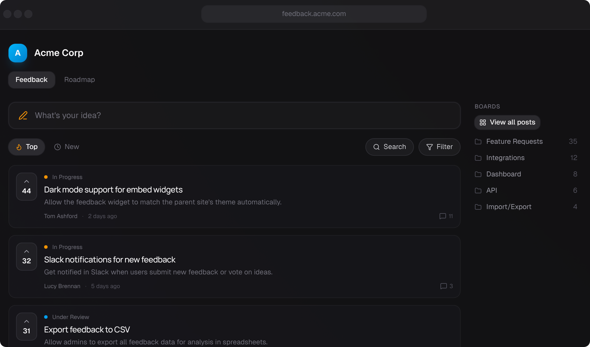

<p align="center">
  <a href="https://quackback.io">
    
  </a>
</p>

<h1 align="center">Quackback</h1>

<p align="center">
  <strong>The open-source customer feedback platform.</strong>
</p>

<p align="center">
  Collect, organize, and act on user feedback with public boards, roadmaps, and changelogs. <br />
  Self-host or use our cloud — the open-source alternative to UserVoice, Canny, and Productboard.
</p>

<p align="center">
  <a href="https://quackback.io">Website</a> •
  <a href="#get-started">Get Started</a> •
  <a href="#features">Features</a> •
  <a href="#self-hosted">Self-Hosted</a> •
  <a href="#contributing">Contributing</a>
</p>

<p align="center">
  
  
</p>

<p align="center">
  
</p>

---

## Get Started

**Cloud** — Get started in minutes at [quackback.io](https://quackback.io). No setup required.

**Self-Hosted** — See the [installation guide](#self-hosted) below.

## Why Quackback?

Feedback tools should be simple. Quackback focuses on the essentials: voting, roadmaps, and changelogs. Open-source, transparent, and free from vendor lock-in.

- **Your choice:** Use our managed cloud or self-host on your own infrastructure.
- **Own your data:** No vendor lock-in. Export anytime, or run it yourself.
- **Modern Stack:** Built with TanStack Start, TanStack Router, and Tailwind. Fast by default.

## Features

- **🗳️ Feedback Portal** — Public boards, upvoting, status tracking, and nested comments.
- **📥 Admin Inbox** — Unified view to triage feedback. Powerful filtering and bulk actions.
- **🗺️ Roadmap & Changelog** — Visually show users what you're building and what you've shipped.
- **🔌 Integrations** — Slack integration, with Linear and Jira coming soon.

## Tech Stack

- **Framework:** TanStack Start + TanStack Router
- **Database:** PostgreSQL + Drizzle ORM
- **Queue:** BullMQ + Dragonfly (Redis-compatible)
- **Auth:** Better Auth
- **Styling:** Tailwind CSS v4 + shadcn/ui
- **Validation:** Zod
- **State:** TanStack Query (server)
- **Runtime:** Bun

## Self-Hosted

Quackback can be deployed anywhere that supports Docker or Node.js.

### One-Click Deploy

[](https://railway.com/deploy/bcnu9a)

### Production (Docker)

```bash
git clone https://github.com/QuackbackIO/quackback.git
cd quackback
cp .env.example .env   # Edit with your configuration
docker build -t quackback .
docker run -p 3000:3000 --env-file .env quackback
```

You'll need to provide your own PostgreSQL database and Redis-compatible store (for background jobs). Set `DATABASE_URL` and `REDIS_URL` in your `.env` file.

### Local Development

Prerequisites: [Bun](https://bun.sh/) v1.3.4+ and [Docker](https://docker.com/)

```bash
git clone https://github.com/QuackbackIO/quackback.git
cd quackback
bun run setup          # Install deps, create .env
docker-compose up -d   # Start PostgreSQL, MinIO, and Dragonfly
bun run db:migrate     # Run migrations
bun run db:seed        # (Optional) Seed demo data
bun run dev            # Start dev server
```

Visit [http://localhost:3000](http://localhost:3000) and log in with `demo@example.com` (OTP code appears in console).

## Roadmap

- [x] Public feedback boards with voting
- [x] Admin inbox with filtering
- [x] Nested comments with reactions
- [x] Official responses
- [ ] Public changelog
- [ ] Email notifications
- [x] Slack integration
- [ ] Intercom / Zendesk integration
- [ ] Jira / Linear integration
- [ ] Zapier integration
- [ ] Webhooks & API keys
- [ ] Custom domains
- [ ] SSO (Okta, Azure AD)

## Contributing

We welcome contributions! See our [Contributing Guide](CONTRIBUTING.md) for details.

- [GitHub Discussions](https://github.com/QuackbackIO/quackback/discussions) — Questions & ideas
- [Discord](https://discord.gg/quackback) — Chat with the community

## License

Quackback is licensed under the [GNU Affero General Public License v3.0 (AGPL-3.0)](LICENSE).

**What this means:**

- **Self-hosting**: Free and fully functional. You can run, modify, and deploy Quackback for your own use
- **Modifications**: If you modify and distribute Quackback (or run it as a service), you must open-source your changes under AGPL-3.0

Contributions require signing our [Contributor License Agreement](CLA.md).

---

<p align="center">
  <sub>Built with 🦆 by the Quackback team</sub>
</p>
