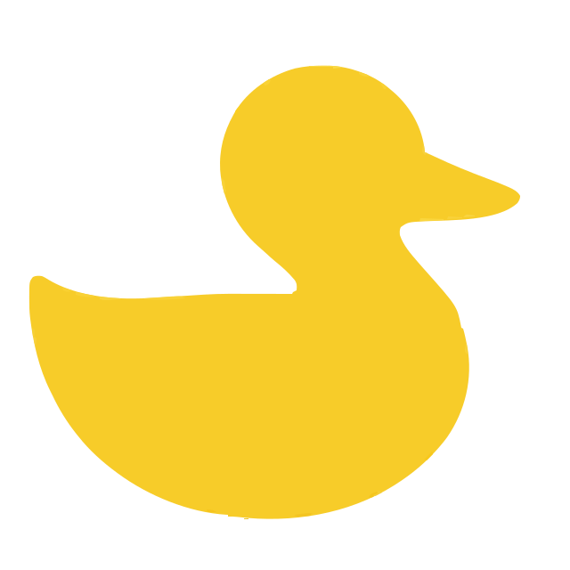
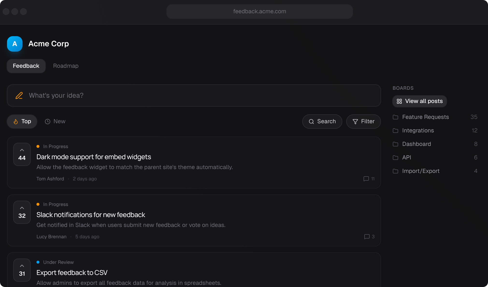

<p align="center">
  <a href="https://quackback.io">
    
  </a>
</p>

<h1 align="center">Quackback</h1>

<p align="center">
  <strong>Open source support and product feedback for teams that ship.</strong>
</p>

<p align="center">
  The open-source alternative to closed feedback and support suites.<br />
  Collect feedback. Answer customers. Prioritize what matters. Close the loop — on infrastructure you own.
</p>

<p align="center">
  <a href="https://quackback.io">Website</a> &middot;
  <a href="https://quackback.io/docs">Docs</a> &middot;
  <a href="#get-started">Get Started</a>
</p>

<p align="center">
  <a href="https://github.com/QuackbackIO/quackback/stargazers"></a>
  <a href="https://github.com/QuackbackIO/quackback/blob/main/LICENSE"></a>
  <a href="https://github.com/QuackbackIO/quackback/actions"></a>
  <a href="https://github.com/QuackbackIO/quackback/issues"></a>
</p>

<p align="center">
  
</p>

## Get Started

**Cloud** — start free at [app.quackback.io](https://app.quackback.io/signup). We host, scale, and maintain it for you. No setup required.

**Self-hosted** anywhere with [Docker](#docker) or [one click on Railway](#one-click-deploy).

## Why Quackback?

Most support-and-feedback suites are expensive, closed-source, and lock you in. Quackback is the suite you actually own: feedback, shared inbox, help center, changelog, status, and AI — self-hosted or cloud.

- **Self-host for free.** Run on your own infrastructure. No per-seat pricing.
- **Own your data.** Feedback, conversations, and knowledge live in your database. No vendor lock-in.
- **AI-powered Quinn.** Duplicate detection, theme summaries, an agent that answers from your knowledge, a teammate Copilot, permissioned tool calls with saveable per-tool rules, and an [MCP server](https://quackback.io/docs/mcp) so your own agents can triage and act.
- **One suite, not five tabs.** Product feedback, support inbox, help center, roadmap, changelog, and status in one product — with [25 integrations](#integrations) out of the box.

## Features

- **Feedback boards.** Let users vote, comment, and track status on feature requests. Vote on behalf of customers, weight demand by plan/MRR, and see a full activity timeline on every post.
- **Support inbox & tickets.** Messenger, email, shared inbox, SLA, macros, and tickets next to the feedback that drives your roadmap.
- **Help Center & Ask AI.** Publish searchable docs; optionally answer from your articles with citations.
- **Roadmap, changelog & status.** Show what's planned and shipped; publish updates; run a public status page with incidents and subscribers.
- **Quinn AI.** Customer Agent + teammate Copilot. Connect MCP servers as **Connectors**; each tool is permissioned Ask for approval / Always allow / Deny. Capture feedback from support threads and close the loop when you ship.
- **Embeddable widget.** Collect feedback and chat inside your app with a [drop-in widget](https://quackback.io/docs/widget/installation). Works on desktop and mobile, with native SDKs for [iOS](https://github.com/QuackbackIO/quackback-ios) and [Android](https://github.com/QuackbackIO/quackback-android).
- **Integrations.** [25 integrations](#integrations) including Slack, Linear, Jira, GitHub, Intercom, Zendesk, and two-way issue tracker sync.
- **API, webhooks & MCP.** Automate workflows with the REST API, outbound webhooks, and a 39-tool [MCP server](https://quackback.io/docs/mcp) for AI agents.
- **Internationalization.** Portal and widget available in English, French, German, Spanish, and Arabic with full RTL support. Auto-detects browser language.
- **Flexible auth.** Password, email OTP, Google, GitHub, and SSO with providers like Okta and Auth0.
- **SEO-ready.** Auto-generated sitemap and social sharing previews on every portal page.

## Integrations

Slack, Linear, Jira, GitHub, GitLab, Asana, ClickUp, Monday, Trello, Notion, Shortcut, Azure DevOps, Intercom, Zendesk, Freshdesk, HubSpot, Salesforce, Stripe, Discord, Teams, Segment, Zapier, Make, and n8n.

## Self-Hosted

### One-Click Deploy

[](https://railway.com/deploy/quackback?referralCode=ez8Slg&utm_source=github&utm_medium=readme&utm_campaign=deploy-button)

### Docker

```bash
git clone https://github.com/QuackbackIO/quackback.git
cd quackback
cp .env.example .env   # Edit with your configuration
docker build -t quackback -f apps/web/Dockerfile .
docker run -p 3000:3000 --env-file .env quackback
```

Requires PostgreSQL and a Redis-compatible store. Set all variables in the canonical [runtime configuration table](docs/configuration.md). Migrations run automatically on startup.

## Contributing

See the [Contributing Guide](CONTRIBUTING.md) to get started.

- [GitHub Discussions](https://github.com/QuackbackIO/quackback/discussions) — ask questions, share ideas

### Local Development

Prerequisites: [Bun](https://bun.sh/) v1.3.7+ and [Docker](https://docker.com/)

```bash
git clone https://github.com/QuackbackIO/quackback.git
cd quackback
bun run setup    # Install deps, start Docker, run migrations
bun run db:seed  # Optional: seed demo data
bun run dev      # http://localhost:3000
```

Log in with `demo@example.com` / `password`.

### Tech Stack

- [TanStack Start](https://tanstack.com/start) + [TanStack Router](https://tanstack.com/router) · Full-stack React framework
- [PostgreSQL](https://www.postgresql.org/) + [Drizzle ORM](https://orm.drizzle.team/) · Database and type-safe ORM
- [BullMQ](https://docs.bullmq.io/) · Background job processing
- [Better Auth](https://www.better-auth.com/) · Authentication
- [Tailwind CSS v4](https://tailwindcss.com/) + [shadcn/ui](https://ui.shadcn.com/) · Styling
- [Bun](https://bun.sh/) · Runtime and package manager

<a href="https://github.com/QuackbackIO/quackback/graphs/contributors">
  
</a>

## License

[AGPL-3.0](LICENSE).

- **Self-hosting** — free and fully functional, no limits
- **Modifications** — if you distribute or run a modified version as a service, open-source your changes under AGPL-3.0

Contributions require signing our [CLA](CLA.md).
