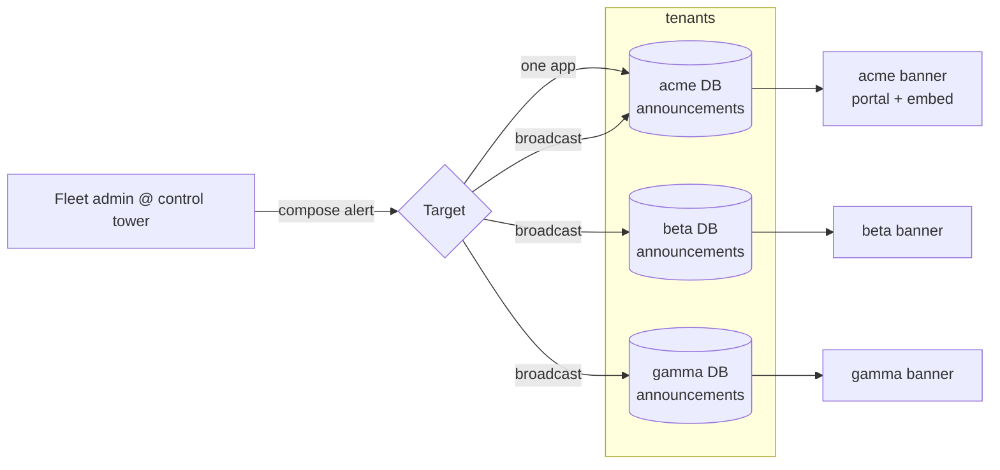

# Announcements Banner Widget — Design Plan

> **Status:** Proposal / planning only. Nothing here is implemented.
> **Goal:** A new sibling to the existing Quackback widget — an **announcements banner** that
> publishes **time-sensitive alerts** (e.g. "we're aware of an issue", scheduled maintenance
> notices) to users **inside the app/portal and as an embeddable banner** on customers' own
> sites. Alerts are **authored/managed centrally from the Tier-B fleet control tower** (see
> `docs/multi-tenant-control-tower-plan.md`) but are **app-specific** — each app's users see
> only that app's alerts.

## 1. Requirements

| #   | Requirement                                                                                                                                                   |
| --- | ------------------------------------------------------------------------------------------------------------------------------------------------------------- |
| R1  | Publish time-sensitive alerts: incident notices ("we know about it") and scheduled maintenance windows.                                                       |
| R2  | Render **in-app** (Quackback portal + optionally the existing widget panel) **and** as an **embeddable banner** on external sites (like the existing widget). |
| R3  | **App-specific**: an alert belongs to one app; end users only ever see their own app's alerts.                                                                |
| R4  | **Managed from the Tier-B unified control tower**: a fleet-admin can publish to one app or broadcast to many from one screen.                                 |
| R5  | Time-based lifecycle: schedule publish, auto-expire, severity levels, dismissible per user.                                                                   |
| R6  | Upgrade-safe: reuse existing infrastructure; keep changes additive where possible.                                                                            |

## 2. TL;DR recommendation

- Add a **thin new `announcements` domain + table** (banner-native: severity, schedule, expiry, dismissible, targeting) that **reuses** the existing scheduler, `notified_at` notify-claim, events/notification, and segment/audience infrastructure — rather than reinventing any of it, and rather than overloading `status_incidents`.
- Optionally have the banner **also surface active status incidents/maintenance** (which already exist), so the single banner slot shows both ad-hoc announcements and live status.
- Render via **two additive surfaces**: (a) an in-app portal/admin banner slot, and (b) a **DOM-only embeddable banner SDK** that mirrors the widget's build/serve/config patterns but needs no iframe.
- **App-specificity is automatic**: announcements live in each app's DB, and the public banner endpoint resolves per `Host` → per workspace. The control tower writes into the correct app(s) via the existing `withWorkspaceScopeById` seam.

## 3. Current-state findings (what to reuse)

### 3.1 Existing widget pattern (mirror this)

- Host SDK: `packages/widget/` — IIFE entry `src/browser-queue.ts` → `dist/browser.js` (tsup, `tsup.config.ts`), public API `src/index.ts`/`src/core/sdk.ts`, config fetch `src/core/config.ts`, version `src/version.ts`.
- Serve + config: `apps/web/src/routes/api/widget/sdk[.]js.ts` (inlines `packages/widget/dist/browser.js?raw` + a per-workspace prelude `window.__QUACKBACK_URL__` / `__QUACKBACK_CONFIG__`), `apps/web/src/routes/api/widget/config[.]json.ts`.
- Single public-config builder: `apps/web/src/lib/server/widget/public-config.ts` `getPublicServerConfig()` (so `sdk.js` and `config.json` never diverge).
- CDN-safe per-workspace caching: `apps/web/src/lib/server/workspaces/http-cache.ts` `publicWorkspaceCacheHeaders(maxAge, ...vary)` with `Vary: Host` + `Access-Control-Allow-Origin: *`.
- CORS envelope + rate limits: `apps/web/src/lib/server/widget/public-endpoint.ts` `widgetCorsHeaders()`.
- Install telemetry (non-blocking): `observeExternalWidgetRequest()` in `domains/settings/settings.widget`.
- Per-workspace config storage: `settings.widget_config` (JSON) + `settings.widget_secret` (HMAC), branding in `settings.branding_config` / `custom_css`; admin UI `apps/web/src/routes/admin/settings.widget.tsx` (+ `.install.tsx`) with a live preview.
- Identity: bearer-only, anonymous lazy-mint + verified HS256 JWT (`widget/identity-token.ts`), device id in localStorage (`packages/widget/src/core/device.ts`).

### 3.2 Status / incident / maintenance (already exists)

- Schema `packages/db/src/schema/status.ts`: `status_incidents` (`kind: incident | maintenance`, lifecycle status, impact, `scheduled_start_at/_end_at`, `auto_start/_complete`, `notified_at`), `status_incident_updates`, `status_components`, `status_subscriptions`, templates.
- Domain `apps/web/src/lib/server/domains/status/*`: `status.service.ts` (create/publish/notify), `status.maintenance.ts` (window start/complete), `status.public.ts` (viewer-scoped reads, segment-gated), `status.audience.ts`.
- Portal `/status` (`_portal/status.index.tsx`) renders active incidents as cards; **no global banner above the header exists**.

### 3.3 Scheduling / lifecycle infrastructure (reuse wholesale)

- Delayed jobs: `events/scheduler.ts` `scheduleDispatch({ jobId, handler, delayMs, payload })` / `cancelScheduledDispatch()`; `events/process.ts` `addDelayedJob` (sets `job_queue.run_at`); handlers in `events/hook-job.ts`.
- Notify-claim: atomic `notified_at` column + periodic reconcile sweeps (`changelog_notify`, `status_notify`, `status_maintenance_sweep` in `cron/fleet-jobs.ts`, armed in `startup.ts` every 5 min).
- Dormancy wake (pooled): `jobs/deadlines.ts` `earliestWorkspaceDeadline()` and `jobs/job-queue.ts` `earliestPendingJobAt()` keep a workspace's worker alive for a pending scheduled publish/expire.
- Reference "publish-at" pattern: `domains/changelog/changelog.service.ts` (`published_at` + `scheduleDispatch('__changelog_publish__')` + reconcile). Reference "start/end" pattern: `status.maintenance.ts`.

### 3.4 Notifications (optional, reusable)

- Events catalogue (`events/catalogue/*`), notification resolver/handlers (`events/handlers/notification.ts` → `in_app_notifications`, `events/handlers/email.ts`), preferences matrix (`domains/subscriptions/notification-matrix.ts`), email templates in `packages/email/src/templates/*`.

### 3.5 Portal rendering slot

- `apps/web/src/routes/_portal.tsx`: `PortalHeader → <main><Outlet/></main> → AuthDialog`. The banner slots in here. Admin shell `apps/web/src/routes/admin.tsx` already renders `PlanNoticeBanner` / `UpdateBanner` (pattern reference, not reused directly).
- Content sanitization for any rich body: `apps/web/src/lib/server/sanitize-tiptap.ts`.

## 4. Design decision: new `announcements` domain (reusing infra) vs extend `status`

| Option                                                                                                                                  | When it fits                                                                                                                                     | Verdict                               |
| --------------------------------------------------------------------------------------------------------------------------------------- | ------------------------------------------------------------------------------------------------------------------------------------------------ | ------------------------------------- |
| **Pure presentation over `status`** (banner renders active incidents/maintenance)                                                       | If "alerts" == outages/maintenance only                                                                                                          | Ship this too, but insufficient alone |
| **New thin `announcements` domain** (dismissible, severity, schedule, expire, arbitrary message + link) reusing scheduler/notify/events | If alerts include general time-sensitive notices not tied to status components, need per-user dismissal, and must be broadcast/managed centrally | **Recommended primary**               |

Rationale for the new domain: an "announcements banner" is a **broadcast, dismissible, severity-tagged message** with its own schedule/expiry that is not always an outage and shouldn't distort incident history or component status. It maps cleanly to a control-tower "publish alert to app(s)" action. It still **reuses** scheduling, `notified_at`, events, and audience/segment gating — no parallel job system. The banner surface can additionally fold in live `status` incidents so users see one consolidated strip.

## 5. Data model (new, additive)

New migration in `packages/db/src/schema/announcements.ts`.

`announcements`:

| Column                                   | Type             | Notes                                                                           |
| ---------------------------------------- | ---------------- | ------------------------------------------------------------------------------- |
| `id`                                     | typeid (`ann_…`) | PK                                                                              |
| `title`                                  | text             | Short headline                                                                  |
| `body`                                   | jsonb/text       | Optional rich body (sanitized via `sanitize-tiptap`)                            |
| `link_url`, `link_label`                 | text             | Optional CTA (e.g. status page)                                                 |
| `severity`                               | enum             | `info` \| `warning` \| `critical` \| `maintenance` (drives color/icon)          |
| `state`                                  | enum             | `draft` \| `scheduled` \| `published` \| `expired` \| `archived`                |
| `publish_at`                             | timestamptz      | Future = scheduled; `null`/past = immediate when published                      |
| `expires_at`                             | timestamptz      | Auto-hide/auto-expire (nullable = manual)                                       |
| `dismissible`                            | boolean          | Whether users can dismiss                                                       |
| `priority`                               | int              | Ordering when multiple are active                                               |
| `surfaces`                               | jsonb            | Where it shows: `portal`, `widget`, `embed` (any subset)                        |
| `audience`                               | jsonb            | `all` or `segment_ids[]` (reuse segment gating)                                 |
| `style`                                  | jsonb            | Optional color/placement overrides                                              |
| `notified_at`                            | timestamptz      | Atomic notify claim (if notifications enabled)                                  |
| `origin`                                 | jsonb            | `{ source: 'control-tower' \| 'local', broadcastId? }` for cross-app broadcasts |
| `created_by`, `created_at`, `updated_at` |                  | Authorship (per-tenant principal)                                               |

`announcement_dismissals` (per-user dismissal, optional):

| Column                                      | Notes                   |
| ------------------------------------------- | ----------------------- |
| `announcement_id` (FK)                      |                         |
| `principal_id` **or** `device_id`           | Identified vs anonymous |
| `dismissed_at`                              |                         |
| (unique on announcement + principal/device) |                         |

Anonymous dismissals also persist client-side (localStorage) so no server write is required for logged-out visitors; server-side rows are for identified users across devices.

## 6. Lifecycle & scheduling (reuse existing scheduler)

- **Publish scheduling:** on create/update with a future `publish_at`, call `scheduleDispatch({ jobId: 'announcement-publish--<id>', handler: '__announcement_publish__', delayMs, payload })`; on fire, flip `state → published` and (optionally) claim `notified_at` + emit a notification event. Cancel/reschedule on edit via `cancelScheduledDispatch`.
- **Auto-expire:** schedule `__announcement_expire__` at `expires_at`; on fire, flip `state → expired`. (This is the one pattern `status`/changelog don't have — model it on the maintenance start/complete pair.)
- **Safety-net sweep:** add `announcement_sweep` (5-min interval, armed in `startup.ts`, body in `cron/fleet-jobs.ts`) → `reconcileAnnouncements()` publishing/expiring rows the delayed job missed, and claiming missed `notified_at`.
- **Dormancy (pooled):** register an `earliestWorkspaceDeadline` provider so a scheduled publish/expire wakes a parked tenant worker.
- **Handlers:** add `__announcement_publish__` / `__announcement_expire__` in `events/hook-job.ts` (additive cases).

## 7. Rendering surfaces

### 7.1 In-app portal banner (server-rendered, additive)

- New `AnnouncementsBanner` component slotted into `apps/web/src/routes/_portal.tsx` between `PortalHeader` and `<main>` (small edit — the only portal-layout touch). Feeds from a new server function `getActiveAnnouncements()` (viewer-scoped, segment-gated via `status.audience`-style logic) that returns active `announcements` (+ optionally active `status_incidents`/maintenance).
- Dismissal via a mutation (identified) or localStorage (anonymous). Severity → color/icon; supports stacking (priority) and a "N more" collapse.
- Optionally also surface inside the existing widget panel (a slim strip in `/widget`), mirroring the existing `widget-changelog-teaser` placement.

### 7.2 Embeddable banner widget (external sites) — DOM-only, no iframe

Mirror the widget's serve/config/versioning, but render a **shadow-DOM bar** injected into the host page (no iframe needed for a slim, sanitized alert bar; shadow DOM isolates CSS):

- **Bundle:** add a banner entry to `packages/widget` — `src/banner-queue.ts` → `dist/banner.js` (IIFE, global `QuackbackBanner`) and an export in `package.json`. Reuses the same tsup build + `publish-widget.yml`. (Alternatively a separate `packages/banner` package — decision in §14.)
- **Serve:** `apps/web/src/routes/api/announcements/sdk[.]js.ts` inlines `dist/banner.js?raw` + a per-workspace prelude (`window.__QUACKBACK_URL__`, baseline config). `Access-Control-Allow-Origin: *`, pre-compressed, cached like the widget SDK.
- **Data:** `apps/web/src/routes/api/announcements/active[.]json.ts` returns the active announcements for the resolved workspace (per `Host`).
- **Embed snippet:** builder like `install-prompt.ts`; `QuackbackBanner.init({ instanceUrl })` fetches `active.json`, renders the bar, wires dismissal to localStorage, polls/refreshes on an interval or via a lightweight revalidate.

### 7.3 Public API contract

`GET /api/announcements/active.json` (per-`Host` workspace):

```jsonc
{
  "enabled": true,
  "revision": "…", // for ETag / client dedupe
  "announcements": [
    {
      "id": "ann_…",
      "severity": "warning",
      "title": "We're investigating elevated error rates",
      "bodyHtml": "…sanitized…",
      "link": { "url": "https://status.acme.com", "label": "Status page" },
      "dismissible": true,
      "priority": 10,
      "publishedAt": "…",
      "expiresAt": "…",
    },
  ],
}
```

- **Caching vs immediacy:** because alerts are time-sensitive, use a **short TTL** (e.g. `max-age=30, stale-while-revalidate=60`) + `Vary: Host` via `publicWorkspaceCacheHeaders`, plus an `ETag`/`revision` so clients skip re-render when unchanged. "Publish now" is visible within the TTL window (seconds), not the hour used by widget config. Document this trade-off explicitly.
- **CORS:** simple GET with query params only (no custom headers) to avoid preflight, per the widget convention.
- **Audience gating:** anonymous embeds see only `audience: all` announcements; identified/portal viewers additionally see segment-targeted ones (reuse `status.audience`/segment logic).

## 8. Per-workspace configuration

- Add an `announcements` block to the workspace config (either a new `settings.announcements_config` JSON column or a key inside the existing widget/portal config), controlling: enabled, placement (top/bottom), default theme, whether the embeddable banner is on, and whether to fold in live status.
- Expose a client-safe projection through a `getPublicAnnouncementsConfig()` builder (mirror `getPublicServerConfig()`), and reuse `observeExternalWidgetRequest`-style telemetry for embed detection if useful.
- Admin UI: new `apps/web/src/routes/admin/settings.announcements.tsx` (+ install page) with a live preview, mirroring `settings.widget.tsx`.

## 9. Cross-tenant management from the Tier-B control tower

This is where R4 + R3 meet, and it falls out of the earlier plan's architecture:

- The control tower (`docs/multi-tenant-control-tower-plan.md`) adds an **Announcements** surface. A fleet-admin composes an alert and chooses **one app** or **multiple apps** (or "all").
- **Write path:** for each target app, `withWorkspaceScopeById(workspaceKey, baseUrl, () => createAnnouncement(input, fleetAdminPrincipalInThatTenant))` — reusing the new `domains/announcements` **service layer** (actor-parameterized), not the RPC layer. Broadcasts stamp a shared `origin.broadcastId` so they can be edited/expired together across apps.
- **App-specificity is inherent:** each announcement row lives in its target app's DB; the public banner endpoint resolves per `Host` → that app's workspace, so an end user only ever sees their app's alerts. No cross-app leakage is possible through the normal request path.
- **Audit:** every publish/edit/expire is written to `cp_fleet_audit` (from the control-tower plan).
- **Aggregated view:** the tower can fan-out read active announcements across all apps (bounded concurrency) to show "what's live where", tagged by app.



## 10. Notifications (optional, phase 2)

- Banners are primarily **passive display** (no opt-in needed to show a broadcast). For high-severity alerts, optionally emit an event (`announcement.published`) reusing the events → `in_app_notifications` + email pipeline and the existing subscription/preferences matrix. Gate behind a per-announcement "also notify" flag to avoid spamming.

## 11. Multi-tenant / pooled considerations

- Per-`Host` resolution + `Vary: Host` caching means one endpoint serves every app with the right body.
- Scheduled publish/expire jobs live in each tenant's `job_queue`; ensure a `worker`/`all` replica runs (already required by the pooled plan). The deadline provider prevents dormant tenants from missing a scheduled publish.
- New table ships via the standard migrator and the fleet migrator (`apps/web/scripts/fleet-migrator.ts`) across all tenants.

## 12. Security

- **XSS:** sanitize any rich `body` with `sanitize-tiptap.ts`; the DOM-only embed renders sanitized HTML inside a **shadow root** with scoped styles.
- **CORS/rate limits:** reuse `widgetCorsHeaders()` + rate limiting on the public endpoints.
- **Audience:** anonymous embeds never receive segment-targeted announcements (avoid leaking targeted messaging); segment gating enforced server-side.
- **Control-tower writes:** SSO + fleet RBAC + audit (per the control-tower plan); per-tenant RBAC still applies because writes act as a real tenant principal.
- **Dismissal integrity:** anonymous dismissal is client-only (low stakes); identified dismissal is a server row keyed by principal.

## 13. Upgrade-safety

- **Additive:** new `announcements` table + domain + server functions, new `/api/announcements/*` routes, new admin route, new banner SDK entry, new sweep + delayed-job handlers, new email/notification types.
- **Reuse (no reinvention):** scheduler (`scheduleDispatch`), `notified_at` claim, reconcile-sweep pattern, events/notification pipeline, segment/audience gating, `publicWorkspaceCacheHeaders`, `widgetCorsHeaders`, `getPublicServerConfig`-style builder, `withWorkspaceScopeById` for cross-tenant writes.
- **Minimal core touches:** one small slot insertion in `_portal.tsx`; a new case in `events/hook-job.ts`; arming one sweep in `startup.ts`; a tsup entry + export in `packages/widget`. These are localized and low-conflict; if this is contributed back, they're clean additions.

## 14. Open decisions

1. **Domain shape:** new `announcements` domain (recommended) vs pure presentation over `status` vs both (banner folds in live status).
2. **Embed transport:** DOM-only shadow-DOM bar (recommended, lightweight) vs iframe (heavier, stronger isolation).
3. **Bundle home:** new entry in `packages/widget` (unified versioning) vs a separate `packages/banner` package.
4. **Config storage:** dedicated `settings.announcements_config` column vs a key in the existing widget/portal config.
5. **Notifications:** display-only v1, or also push in-app/email for critical alerts.
6. **Dismissal:** client-only vs server-persisted for identified users (recommended: both).
7. **Cache immediacy:** acceptable TTL for the public endpoint (e.g. 30s SWR) vs a push/invalidate mechanism for instant global updates.

## 15. Phased plan (with validation)

| Phase                            | Deliverable                                                                                                                                      | Validation                                                                                              |
| -------------------------------- | ------------------------------------------------------------------------------------------------------------------------------------------------ | ------------------------------------------------------------------------------------------------------- |
| **1. Data + domain**             | `announcements` (+ `announcement_dismissals`) schema; `domains/announcements` service (CRUD, publish, expire, active-query with audience gating) | Unit/db tests; migrate locally; create/publish/expire an announcement via the service                   |
| **2. Scheduling**                | `__announcement_publish__` / `__announcement_expire__` handlers + `announcement_sweep` + deadline provider                                       | Schedule a publish 1 min out and an expiry; confirm both fire and the sweep reconciles a missed one     |
| **3. In-app portal banner**      | `AnnouncementsBanner` + `_portal.tsx` slot + `getActiveAnnouncements()` + dismissal                                                              | Manual: publish an alert, see it in the portal for the right app only; dismiss persists                 |
| **4. Admin authoring**           | `settings.announcements.tsx` authoring + live preview + per-workspace config                                                                     | Author, schedule, edit, expire from admin; preview matches portal                                       |
| **5. Embeddable banner SDK**     | `packages/widget` banner entry + `/api/announcements/sdk.js` + `active.json` + embed snippet + shadow-DOM render + localStorage dismissal        | Embed on a scratch HTML page; banner shows the app's alert, dismiss sticks, short-TTL refresh works     |
| **6. Control-tower integration** | Announcements surface in the Tier-B tower: publish to one app or broadcast; fan-out read; audit                                                  | From one login, publish to app A only (verify B unaffected), then broadcast to A+B; audit rows recorded |
| **7. Notifications (optional)**  | `announcement.published` event → in-app/email for critical, gated by flag                                                                        | Critical alert notifies subscribers; info alert does not                                                |

## 16. Validation & testing strategy

- **Isolation:** confirm an announcement created in app A never appears on app B's portal or embed (leverage the pooled isolation probe mindset).
- **Scheduling:** deterministic tests for publish-at/expire-at + sweep reconciliation (mirror `status-publish`/changelog tests).
- **Embed:** a static host page loading `/api/announcements/sdk.js` from a local tenant; verify CORS, shadow-DOM style isolation, dismissal, and short-TTL refresh.
- **Control tower:** end-to-end publish (single + broadcast) across two local tenants; verify per-app rendering and audit.
- **Manual GUI:** portal banner + admin authoring + embed demo recorded as a walkthrough.

## 17. File / seam index

Reuse (existing):

- Widget pattern: `packages/widget/*`, `apps/web/src/routes/api/widget/*`, `apps/web/src/lib/server/widget/public-config.ts`, `.../widget/public-endpoint.ts`, `workspaces/http-cache.ts`, `domains/settings/settings.widget.ts`, admin `settings.widget.tsx`.
- Status/maintenance: `packages/db/src/schema/status.ts`, `domains/status/*` (esp. `status.maintenance.ts`, `status.public.ts`, `status.audience.ts`).
- Scheduling/notify: `events/scheduler.ts`, `events/process.ts`, `events/hook-job.ts`, `cron/fleet-jobs.ts`, `startup.ts`, `jobs/deadlines.ts`, `jobs/job-queue.ts`, `events/handlers/notification.ts`, `events/handlers/email.ts`, `domains/subscriptions/notification-matrix.ts`, `packages/email/src/templates/*`.
- Portal slot + sanitize: `apps/web/src/routes/_portal.tsx`, `apps/web/src/lib/server/sanitize-tiptap.ts`.
- Cross-tenant: `workspaces/workspace-context.ts` (`withWorkspaceScopeById`), `workspaces/registry.ts` (`listActiveWorkspaces`), and the control-tower plan (`docs/multi-tenant-control-tower-plan.md`).

New (to build, additive):

- `packages/db/src/schema/announcements.ts` (+ migration)
- `apps/web/src/lib/server/domains/announcements/*` (service, public reads, scheduling)
- `apps/web/src/routes/api/announcements/active[.]json.ts`, `.../sdk[.]js.ts`
- `apps/web/src/components/**/announcements-banner.tsx` + `_portal.tsx` slot
- `apps/web/src/routes/admin/settings.announcements.tsx`
- `packages/widget/src/banner-queue.ts` (+ tsup entry/export) or new `packages/banner`
- `__announcement_publish__` / `__announcement_expire__` handlers + `announcement_sweep`
- Control-tower Announcements surface (in the Tier-B tower)

## 18. Relationship to the other plans

- **Depends on / complements** `docs/multi-tenant-control-tower-plan.md` for R4 (central management) and R3 (app-specific rendering via pooled per-`Host` resolution).
- Standalone-usable in single-tenant mode too: the portal banner + embed work without pooling; the control-tower integration is the multi-app layer on top.
