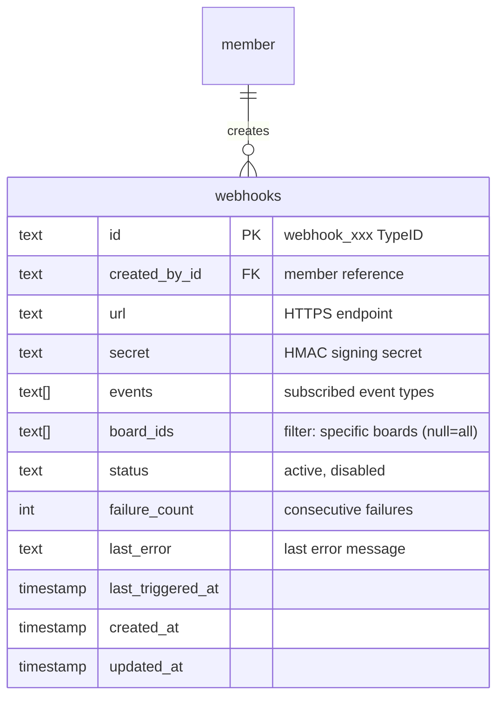

# ✨ feat: Webhooks API (v1 - Simplified)

## Overview

Implement a webhook system that notifies external services when events occur in Quackback. Customers can register HTTP endpoints to receive real-time notifications for feedback activity.

**Use Cases:** Support tool integration, PM tool sync (Linear/Jira), Slack automation, AI triage workflows.

**Architecture:** Lightweight in-process delivery with synchronous retries. No external dependencies.

---

## Scope (v1)

### In Scope

- 3 events: `post.created`, `post.status_changed`, `comment.created`
- CRUD API for webhooks
- HMAC-SHA256 signatures
- SSRF protection (block private IPs)
- Board-based filtering
- Auto-disable after 50 consecutive failures
- Sync retries (3 attempts: 1s, 5s, 30s delays)
- Admin-only access
- 25 webhook limit per workspace

### Out of Scope (v2 candidates)

- `post.vote_threshold` event (customers can filter on voteCount in post.created)
- Tag filtering (board filtering covers 90% of use cases)
- Delivery history table/API (log to stdout for debugging)
- Async retry worker (sync retries sufficient for v1)
- Test webhook endpoint (customers can test by creating a post)

---

## Key Decisions

| Decision       | Choice                                                   | Rationale                       |
| -------------- | -------------------------------------------------------- | ------------------------------- |
| Events         | `post.created`, `post.status_changed`, `comment.created` | Core integration needs          |
| Filtering      | Board IDs only                                           | Simpler, covers most use cases  |
| Retries        | Sync: 3 attempts (1s, 5s, 30s)                           | No worker infrastructure needed |
| Retry triggers | 5xx, timeouts, network errors                            | 4xx = permanent failure         |
| Authorization  | Admin role only                                          | Consistent with integrations    |
| Webhook scope  | Workspace-scoped via `createdById`                       | Proper multi-tenant isolation   |
| Status         | `active` or `disabled`                                   | No paused state needed          |
| Auto-disable   | After 50 consecutive failures                            | Prevents infinite loops         |
| URL validation | Block private IPs, require HTTPS                         | SSRF protection                 |
| Webhook limit  | 25 per workspace                                         | Resource protection             |

---

## Database Schema

```sql
CREATE TABLE webhooks (
  id TEXT PRIMARY KEY,
  created_by_id TEXT NOT NULL REFERENCES member(id),
  url TEXT NOT NULL,
  secret TEXT NOT NULL,
  events TEXT[] NOT NULL,
  board_ids TEXT[],
  status TEXT NOT NULL DEFAULT 'active',
  failure_count INTEGER NOT NULL DEFAULT 0,
  last_error TEXT,
  last_triggered_at TIMESTAMP WITH TIME ZONE,
  created_at TIMESTAMP WITH TIME ZONE NOT NULL DEFAULT NOW(),
  updated_at TIMESTAMP WITH TIME ZONE NOT NULL DEFAULT NOW()
);

CREATE INDEX webhooks_status_idx ON webhooks(status);
CREATE INDEX webhooks_created_by_idx ON webhooks(created_by_id);
```



---

## Implementation Phases

### Phase 1: Foundation

#### 1.1 Add TypeID Prefix

**File: `packages/ids/src/prefixes.ts`**

```typescript
export const ID_PREFIXES = {
  // ... existing
  webhook: 'webhook',
} as const
```

**File: `packages/ids/src/types.ts`**

```typescript
export type WebhookId = TypeId<'webhook'>

// Add to EntityIdMap
export interface EntityIdMap {
  // ... existing
  webhook: WebhookId
}
```

#### 1.2 Create Database Schema

**File: `packages/db/src/schema/webhooks.ts`**

```typescript
import { pgTable, text, timestamp, integer, index } from 'drizzle-orm/pg-core'
import { typeIdWithDefault, typeIdColumn } from '@quackback/ids/drizzle'
import { relations } from 'drizzle-orm'
import { member } from './members'

export const webhooks = pgTable(
  'webhooks',
  {
    id: typeIdWithDefault('webhook')('id').primaryKey(),
    createdById: typeIdColumn('member')('created_by_id')
      .notNull()
      .references(() => member.id),
    url: text('url').notNull(),
    secret: text('secret').notNull(),
    events: text('events').array().notNull(),
    boardIds: text('board_ids').array(),
    status: text('status', { enum: ['active', 'disabled'] })
      .notNull()
      .default('active'),
    failureCount: integer('failure_count').notNull().default(0),
    lastError: text('last_error'),
    lastTriggeredAt: timestamp('last_triggered_at', { withTimezone: true }),
    createdAt: timestamp('created_at', { withTimezone: true }).notNull().defaultNow(),
    updatedAt: timestamp('updated_at', { withTimezone: true }).notNull().defaultNow(),
  },
  (table) => [
    index('webhooks_status_idx').on(table.status),
    index('webhooks_created_by_idx').on(table.createdById),
  ]
)

export const webhooksRelations = relations(webhooks, ({ one }) => ({
  createdBy: one(member, {
    fields: [webhooks.createdById],
    references: [member.id],
  }),
}))
```

#### 1.3 Create Migration

**File: `packages/db/drizzle/0015_add_webhooks.sql`**

```sql
CREATE TABLE IF NOT EXISTS webhooks (
  id TEXT PRIMARY KEY,
  created_by_id TEXT NOT NULL REFERENCES member(id),
  url TEXT NOT NULL,
  secret TEXT NOT NULL,
  events TEXT[] NOT NULL,
  board_ids TEXT[],
  status TEXT NOT NULL DEFAULT 'active',
  failure_count INTEGER NOT NULL DEFAULT 0,
  last_error TEXT,
  last_triggered_at TIMESTAMP WITH TIME ZONE,
  created_at TIMESTAMP WITH TIME ZONE NOT NULL DEFAULT NOW(),
  updated_at TIMESTAMP WITH TIME ZONE NOT NULL DEFAULT NOW()
);

CREATE INDEX IF NOT EXISTS webhooks_status_idx ON webhooks(status);
CREATE INDEX IF NOT EXISTS webhooks_created_by_idx ON webhooks(created_by_id);
```

---

### Phase 2: Hook Handler

**File: `apps/web/src/lib/hooks/webhook/handler.ts`**

```typescript
import crypto from 'crypto'
import type { HookHandler, HookResult } from '../types'
import type { WebhookId } from '@quackback/ids'
import { db, webhooks, eq } from '@/lib/db'

export interface WebhookTarget {
  url: string
}

export interface WebhookConfig {
  secret: string
  webhookId: WebhookId
}

const TIMEOUT_MS = 10_000
const RETRY_DELAYS = [1000, 5000, 30_000] // 1s, 5s, 30s
const USER_AGENT = 'Quackback-Webhook/1.0 (+https://quackback.io)'
const MAX_FAILURES = 50

export const webhookHook: HookHandler = {
  async run(event, target, config): Promise<HookResult> {
    const { url } = target as WebhookTarget
    const { secret, webhookId } = config as WebhookConfig

    const payload = JSON.stringify({
      id: crypto.randomUUID(),
      type: event.type,
      createdAt: event.timestamp,
      data: event.data,
    })

    const timestamp = Math.floor(Date.now() / 1000)
    const signaturePayload = `${timestamp}.${payload}`
    const signature = crypto.createHmac('sha256', secret).update(signaturePayload).digest('hex')

    const headers = {
      'Content-Type': 'application/json',
      'User-Agent': USER_AGENT,
      'X-Quackback-Signature': `sha256=${signature}`,
      'X-Quackback-Timestamp': String(timestamp),
      'X-Quackback-Event': event.type,
    }

    // Sync retries
    let lastError: string | undefined
    for (let attempt = 0; attempt <= RETRY_DELAYS.length; attempt++) {
      try {
        const controller = new AbortController()
        const timeoutId = setTimeout(() => controller.abort(), TIMEOUT_MS)

        const response = await fetch(url, {
          method: 'POST',
          headers,
          body: payload,
          signal: controller.signal,
        })

        clearTimeout(timeoutId)

        if (response.ok) {
          // Success - reset failure count
          await db
            .update(webhooks)
            .set({ failureCount: 0, lastTriggeredAt: new Date(), lastError: null })
            .where(eq(webhooks.id, webhookId))
          return { success: true }
        }

        // 4xx = client error, don't retry
        if (response.status >= 400 && response.status < 500) {
          lastError = `HTTP ${response.status}`
          break
        }

        lastError = `HTTP ${response.status}`
      } catch (error) {
        lastError = error instanceof Error ? error.message : 'Unknown error'
      }

      // Wait before retry (unless last attempt)
      if (attempt < RETRY_DELAYS.length) {
        await new Promise((resolve) => setTimeout(resolve, RETRY_DELAYS[attempt]))
      }
    }

    // All retries failed - update failure count
    const webhook = await db.query.webhooks.findFirst({
      where: eq(webhooks.id, webhookId),
    })

    const newFailureCount = (webhook?.failureCount ?? 0) + 1
    const newStatus = newFailureCount >= MAX_FAILURES ? 'disabled' : webhook?.status

    await db
      .update(webhooks)
      .set({
        failureCount: newFailureCount,
        lastError,
        lastTriggeredAt: new Date(),
        status: newStatus,
      })
      .where(eq(webhooks.id, webhookId))

    return { success: false, error: lastError, shouldRetry: false }
  },
}
```

**File: `apps/web/src/lib/hooks/webhook/index.ts`**

```typescript
export { webhookHook } from './handler'
export type { WebhookTarget, WebhookConfig } from './handler'

// URL validation for SSRF protection
const PRIVATE_IP_RANGES = [
  /^127\./,
  /^10\./,
  /^172\.(1[6-9]|2[0-9]|3[01])\./,
  /^192\.168\./,
  /^169\.254\./,
  /^0\./,
  /^localhost$/i,
]

export function isValidWebhookUrl(urlString: string): boolean {
  try {
    const url = new URL(urlString)

    // Require HTTPS in production
    if (process.env.NODE_ENV === 'production' && url.protocol !== 'https:') {
      return false
    }

    // Block private IPs
    const hostname = url.hostname
    for (const pattern of PRIVATE_IP_RANGES) {
      if (pattern.test(hostname)) {
        return false
      }
    }

    return true
  } catch {
    return false
  }
}
```

**File: `apps/web/src/lib/hooks/index.ts`** - Add registration

```typescript
import { webhookHook } from './webhook/handler'
registerHook('webhook', webhookHook)
```

---

### Phase 3: Event Integration

**File: `apps/web/src/lib/events/targets.ts`** - Add to `getHookTargets()`

```typescript
export async function getHookTargets(event: EventData): Promise<HookTarget[]> {
  const targets: HookTarget[] = []

  // ... existing slack, email, notification targets

  // Add webhook targets
  const matchingWebhooks = await findMatchingWebhooks(event)
  for (const webhook of matchingWebhooks) {
    targets.push({
      type: 'webhook',
      target: { url: webhook.url },
      config: { secret: webhook.secret, webhookId: webhook.id },
    })
  }

  return targets
}

async function findMatchingWebhooks(event: EventData): Promise<Webhook[]> {
  const { db, webhooks, eq, and, or, arrayContains } = await import('@/lib/db')

  // Get all active webhooks subscribed to this event type
  const allWebhooks = await db.query.webhooks.findMany({
    where: and(eq(webhooks.status, 'active'), arrayContains(webhooks.events, [event.type])),
  })

  // Filter by board if applicable
  const boardId = event.data?.post?.boardId || event.data?.boardId

  return allWebhooks.filter((webhook) => {
    // No board filter = match all
    if (!webhook.boardIds || webhook.boardIds.length === 0) {
      return true
    }
    // Board filter = must match
    return boardId && webhook.boardIds.includes(boardId)
  })
}
```

---

### Phase 4: API Routes

**File: `apps/web/src/routes/api/v1/webhooks.ts`** (single file for all routes)

```typescript
import { createFileRoute } from '@tanstack/react-router'
import { z } from 'zod'
import crypto from 'crypto'
import { withApiKeyAuth } from '@/lib/api/auth'
import {
  successResponse,
  createdResponse,
  badRequestResponse,
  notFoundResponse,
  handleDomainError,
} from '@/lib/api/responses'
import { validateTypeId } from '@/lib/api/validation'
import { isValidWebhookUrl } from '@/lib/hooks/webhook'
import type { WebhookId } from '@quackback/ids'

const WEBHOOK_EVENTS = ['post.created', 'post.status_changed', 'comment.created'] as const

const createWebhookSchema = z.object({
  url: z
    .string()
    .url()
    .refine(isValidWebhookUrl, 'Invalid webhook URL (must be HTTPS, no private IPs)'),
  events: z.array(z.enum(WEBHOOK_EVENTS)).min(1, 'At least one event required'),
  boardIds: z.array(z.string()).optional(),
})

const updateWebhookSchema = z.object({
  url: z.string().url().refine(isValidWebhookUrl, 'Invalid webhook URL').optional(),
  events: z.array(z.enum(WEBHOOK_EVENTS)).min(1).optional(),
  boardIds: z.array(z.string()).nullable().optional(),
  status: z.enum(['active', 'disabled']).optional(),
})

export const Route = createFileRoute('/api/v1/webhooks')({
  server: {
    handlers: {
      // GET /api/v1/webhooks - List webhooks
      GET: async ({ request }) => {
        const authResult = await withApiKeyAuth(request)
        if (authResult instanceof Response) return authResult

        const { db, webhooks } = await import('@/lib/db')
        const allWebhooks = await db.query.webhooks.findMany()

        return successResponse(
          allWebhooks.map((w) => ({
            id: w.id,
            url: w.url,
            events: w.events,
            boardIds: w.boardIds,
            status: w.status,
            failureCount: w.failureCount,
            lastTriggeredAt: w.lastTriggeredAt?.toISOString() ?? null,
            createdAt: w.createdAt.toISOString(),
          }))
        )
      },

      // POST /api/v1/webhooks - Create webhook
      POST: async ({ request }) => {
        const authResult = await withApiKeyAuth(request)
        if (authResult instanceof Response) return authResult
        const { memberId } = authResult

        try {
          const body = await request.json()
          const parsed = createWebhookSchema.safeParse(body)
          if (!parsed.success) {
            return badRequestResponse('Invalid request', {
              errors: parsed.error.flatten().fieldErrors,
            })
          }

          // Check webhook limit (25 per workspace)
          const { db, webhooks } = await import('@/lib/db')
          const count = await db.query.webhooks.findMany()
          if (count.length >= 25) {
            return badRequestResponse('Webhook limit reached (max 25)')
          }

          // Generate secret
          const secret = `whsec_${crypto.randomBytes(32).toString('base64url')}`

          const { createId } = await import('@quackback/ids')
          const [webhook] = await db
            .insert(webhooks)
            .values({
              id: createId('webhook'),
              createdById: memberId,
              url: parsed.data.url,
              secret,
              events: parsed.data.events,
              boardIds: parsed.data.boardIds ?? null,
            })
            .returning()

          return createdResponse({
            id: webhook.id,
            url: webhook.url,
            secret, // Only shown on creation!
            events: webhook.events,
            boardIds: webhook.boardIds,
            status: webhook.status,
            createdAt: webhook.createdAt.toISOString(),
          })
        } catch (error) {
          return handleDomainError(error)
        }
      },
    },
  },
})
```

**File: `apps/web/src/routes/api/v1/webhooks.$webhookId.ts`**

```typescript
import { createFileRoute } from '@tanstack/react-router'
import { withApiKeyAuth } from '@/lib/api/auth'
import {
  successResponse,
  noContentResponse,
  notFoundResponse,
  badRequestResponse,
  handleDomainError,
} from '@/lib/api/responses'
import { validateTypeId } from '@/lib/api/validation'
import type { WebhookId } from '@quackback/ids'

export const Route = createFileRoute('/api/v1/webhooks/$webhookId')({
  server: {
    handlers: {
      // GET /api/v1/webhooks/:webhookId
      GET: async ({ request, params }) => {
        const authResult = await withApiKeyAuth(request)
        if (authResult instanceof Response) return authResult

        const validationError = validateTypeId(params.webhookId, 'webhook', 'webhook ID')
        if (validationError) return validationError

        const { db, webhooks, eq } = await import('@/lib/db')
        const webhook = await db.query.webhooks.findFirst({
          where: eq(webhooks.id, params.webhookId as WebhookId),
        })

        if (!webhook) return notFoundResponse('Webhook')

        return successResponse({
          id: webhook.id,
          url: webhook.url,
          events: webhook.events,
          boardIds: webhook.boardIds,
          status: webhook.status,
          failureCount: webhook.failureCount,
          lastError: webhook.lastError,
          lastTriggeredAt: webhook.lastTriggeredAt?.toISOString() ?? null,
          createdAt: webhook.createdAt.toISOString(),
        })
      },

      // PATCH /api/v1/webhooks/:webhookId
      PATCH: async ({ request, params }) => {
        const authResult = await withApiKeyAuth(request)
        if (authResult instanceof Response) return authResult

        const validationError = validateTypeId(params.webhookId, 'webhook', 'webhook ID')
        if (validationError) return validationError

        try {
          const body = await request.json()
          // Validation schema from webhooks.ts would be imported here

          const { db, webhooks, eq } = await import('@/lib/db')
          const [updated] = await db
            .update(webhooks)
            .set({ ...body, updatedAt: new Date() })
            .where(eq(webhooks.id, params.webhookId as WebhookId))
            .returning()

          if (!updated) return notFoundResponse('Webhook')

          return successResponse({
            id: updated.id,
            url: updated.url,
            events: updated.events,
            boardIds: updated.boardIds,
            status: updated.status,
            failureCount: updated.failureCount,
            lastTriggeredAt: updated.lastTriggeredAt?.toISOString() ?? null,
            createdAt: updated.createdAt.toISOString(),
          })
        } catch (error) {
          return handleDomainError(error)
        }
      },

      // DELETE /api/v1/webhooks/:webhookId
      DELETE: async ({ request, params }) => {
        const authResult = await withApiKeyAuth(request)
        if (authResult instanceof Response) return authResult

        const validationError = validateTypeId(params.webhookId, 'webhook', 'webhook ID')
        if (validationError) return validationError

        const { db, webhooks, eq } = await import('@/lib/db')
        const [deleted] = await db
          .delete(webhooks)
          .where(eq(webhooks.id, params.webhookId as WebhookId))
          .returning()

        if (!deleted) return notFoundResponse('Webhook')

        return noContentResponse()
      },
    },
  },
})
```

---

## Acceptance Criteria

### Functional Requirements

- [x] Can create webhook with URL, events, and optional board filter
- [x] Can list, get, update, delete webhooks
- [x] Webhook secret shown only on creation (never returned on GET)
- [x] Events fire for matching webhooks based on board filter
- [x] Failed deliveries retry 3 times with backoff (1s, 5s, 30s)
- [x] Webhook auto-disabled after 50 consecutive failures

### Non-Functional Requirements

- [x] Webhook URLs validated (HTTPS in prod, no private IPs)
- [x] HMAC-SHA256 signature on all deliveries
- [x] 10-second timeout per delivery attempt
- [x] Max 25 webhooks per workspace
- [x] Admin role required for webhook management

---

## Files to Create

| File                                                | Purpose                  |
| --------------------------------------------------- | ------------------------ |
| `packages/ids/src/prefixes.ts`                      | Add `webhook` prefix     |
| `packages/ids/src/types.ts`                         | Add `WebhookId` type     |
| `packages/db/src/schema/webhooks.ts`                | Database schema          |
| `packages/db/drizzle/0015_add_webhooks.sql`         | Migration                |
| `apps/web/src/lib/hooks/webhook/handler.ts`         | Hook handler + delivery  |
| `apps/web/src/lib/hooks/webhook/index.ts`           | Exports + URL validation |
| `apps/web/src/routes/api/v1/webhooks.ts`            | List + Create routes     |
| `apps/web/src/routes/api/v1/webhooks.$webhookId.ts` | Get/Update/Delete routes |

## Files to Modify

| File                                 | Change                        |
| ------------------------------------ | ----------------------------- |
| `packages/ids/src/index.ts`          | Export WebhookId              |
| `packages/db/src/schema/index.ts`    | Export webhooks schema        |
| `apps/web/src/lib/hooks/index.ts`    | Register webhook hook         |
| `apps/web/src/lib/events/targets.ts` | Add webhook target resolution |

---

## Testing Strategy

1. **Unit tests** for URL validation (SSRF protection)
2. **Unit tests** for board filter matching logic
3. **Integration tests** for webhook CRUD operations
4. **Integration tests** for webhook delivery with mock server
5. **API tests** for all webhook endpoints

---

## v2 Candidates (if customers request)

- `post.vote_threshold` event with configurable thresholds
- Tag-based filtering
- Delivery history table and API
- Test webhook endpoint
- Async retry worker for high volume

---

## References

- **Brainstorm:** `docs/brainstorms/2026-01-30-webhooks-brainstorm.md`
- **Existing patterns:** `apps/web/src/lib/hooks/slack/handler.ts`
- **Event system:** `apps/web/src/lib/events/dispatch.ts`
