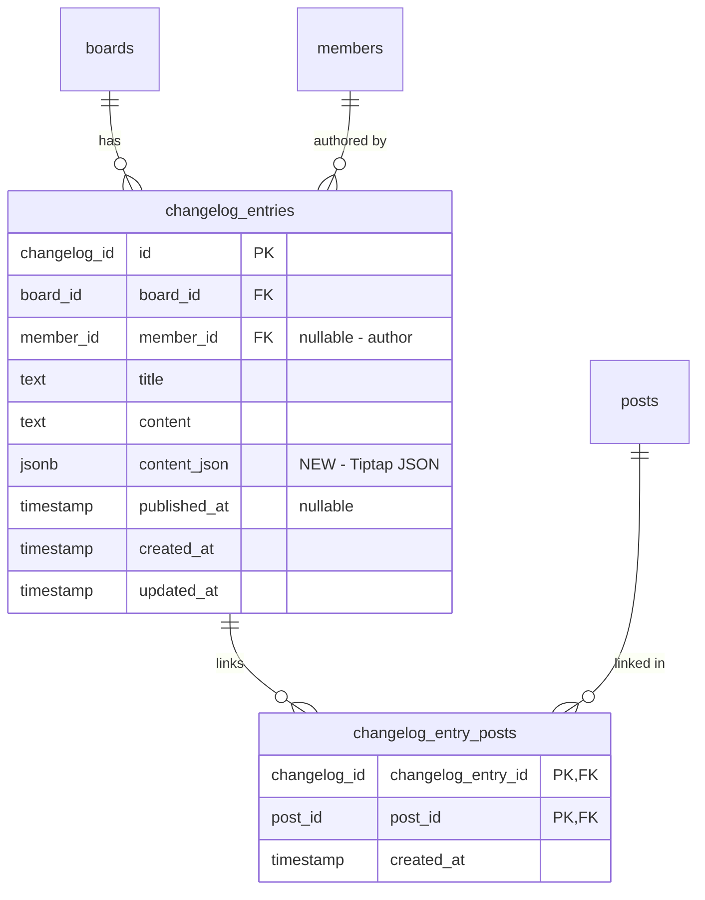

# Changelog Creation UI with Rich Text Editor

## Overview

Build a complete changelog feature that allows admins to create beautiful, rich-text changelog entries announcing shipped features and product updates. This includes admin UI for creation/editing, enhanced Tiptap editor with images and code blocks, S3-compatible storage for image uploads (with MinIO for local development), and a public `/changelog` portal page.

**Brainstorm Document:** `docs/brainstorms/2026-02-01-changelog-ui-brainstorm.md`

## Problem Statement / Motivation

Quackback has partial changelog implementation (database schema and API) but no way for admins to create or manage changelog entries through the UI. Users have no way to view published changelogs. This feature completes the changelog system with:

1. Admin-friendly creation experience matching the post creation UX
2. Rich text support for headers, images, and code blocks
3. Ability to link shipped posts to changelog entries
4. Draft/schedule/publish workflow
5. Public changelog page for portal users

## Proposed Solution

Extend existing patterns from post creation to build changelog management:

- **Admin UI**: Dialog-based creation following `CreatePostDialog` pattern
- **Rich Text Editor**: Enhance shared `RichTextEditor` with configurable features (images, headings, code blocks)
- **Image Upload**: S3-compatible storage via presigned URLs with MinIO for local dev
- **Publishing**: Use existing `publishedAt` field for draft/scheduled/published states
- **Post Linking**: Junction table with searchable multi-select component
- **Public View**: New `/changelog` portal route

## Technical Approach

### Architecture

```
┌─────────────────────────────────────────────────────────────────────────┐
│                           Admin UI Layer                                 │
├─────────────────────────────────────────────────────────────────────────┤
│  CreateChangelogDialog  │  ChangelogFormFields  │  ChangelogList        │
│  - Title input          │  - RichTextEditor     │  - Paginated table    │
│  - Publish controls     │  - LinkedPostsSelect  │  - Status badges      │
│  - Save/Cancel          │  - Board selector     │  - Edit/Delete        │
└─────────────────────────────────────────────────────────────────────────┘
                                    │
                                    ▼
┌─────────────────────────────────────────────────────────────────────────┐
│                         Client Layer (lib/client)                        │
├─────────────────────────────────────────────────────────────────────────┤
│  mutations/changelog.ts          │  queries/changelog.ts                 │
│  - useCreateChangelog            │  - changelogKeys factory              │
│  - useUpdateChangelog            │  - useChangelogList                   │
│  - useDeleteChangelog            │  - useChangelogEntry                  │
│  - useUploadImage                │  - useShippedPosts                    │
└─────────────────────────────────────────────────────────────────────────┘
                                    │
                                    ▼
┌─────────────────────────────────────────────────────────────────────────┐
│                       Server Layer (lib/server)                          │
├─────────────────────────────────────────────────────────────────────────┤
│  functions/changelog.ts          │  functions/uploads.ts                 │
│  - createChangelogFn             │  - getPresignedUploadUrlFn            │
│  - updateChangelogFn             │                                       │
│  - deleteChangelogFn             │  domains/changelog/                   │
│  - publishChangelogFn            │  - changelog.service.ts               │
│  - listChangelogsFn              │  - changelog.types.ts                 │
└─────────────────────────────────────────────────────────────────────────┘
                                    │
                                    ▼
┌─────────────────────────────────────────────────────────────────────────┐
│                         Database Layer                                   │
├─────────────────────────────────────────────────────────────────────────┤
│  changelog_entries               │  changelog_entry_posts                │
│  + contentJson (jsonb)           │  - changelogEntryId (FK)              │
│  + memberId (FK, nullable)       │  - postId (FK)                        │
│                                  │  - createdAt                          │
└─────────────────────────────────────────────────────────────────────────┘
```

### Implementation Phases

#### Phase 1: Infrastructure & Schema (Foundation)

Database migrations, S3 client, Docker Compose MinIO setup.

**Tasks:**

- [ ] Add `contentJson` field to `changelog_entries` table
- [ ] Add `memberId` field to track changelog author
- [ ] Create `changelog_entry_posts` junction table
- [ ] Add MinIO service to `docker-compose.yml`
- [ ] Create S3 client utility (`lib/server/storage/s3.ts`)
- [ ] Add environment variables to `.env.example`
- [ ] Create presigned URL server function

**Files to create/modify:**

```
packages/db/drizzle/XXXX_changelog_enhancements.sql     # Migration
packages/db/src/schema/changelog.ts                      # Schema updates
docker-compose.yml                                       # Add MinIO
apps/web/.env.example                                    # S3 env vars
apps/web/src/lib/server/storage/s3.ts                   # S3 client
apps/web/src/lib/server/functions/uploads.ts            # Upload functions
```

**Schema changes:**

```typescript
// packages/db/src/schema/changelog.ts - additions
export const changelogEntries = pgTable('changelog_entries', {
  // ... existing fields ...
  contentJson: jsonb('content_json').$type<TiptapContent>(),
  memberId: typeIdColumnNullable('member')('member_id').references(() => members.id, {
    onDelete: 'set null',
  }),
})

export const changelogEntryPosts = pgTable(
  'changelog_entry_posts',
  {
    changelogEntryId: typeIdColumn('changelog')('changelog_entry_id')
      .notNull()
      .references(() => changelogEntries.id, { onDelete: 'cascade' }),
    postId: typeIdColumn('post')('post_id')
      .notNull()
      .references(() => posts.id, { onDelete: 'cascade' }),
    createdAt: timestamp('created_at', { withTimezone: true }).defaultNow().notNull(),
  },
  (table) => ({
    pk: primaryKey({ columns: [table.changelogEntryId, table.postId] }),
  })
)
```

**Docker Compose MinIO:**

```yaml
# docker-compose.yml - add MinIO service
services:
  # ... postgres ...

  minio:
    image: minio/minio:latest
    container_name: quackback-minio
    restart: unless-stopped
    environment:
      MINIO_ROOT_USER: minioadmin
      MINIO_ROOT_PASSWORD: minioadmin
    ports:
      - '9000:9000' # S3 API
      - '9001:9001' # Console
    volumes:
      - minio_data:/data
    command: server /data --console-address ":9001"
    healthcheck:
      test: ['CMD', 'mc', 'ready', 'local']
      interval: 5s
      timeout: 5s
      retries: 5

volumes:
  postgres_data:
  minio_data:
```

**Environment variables:**

```bash
# S3-compatible storage (MinIO for local, S3/R2/B2 for production)
S3_ENDPOINT=http://localhost:9000
S3_BUCKET=quackback
S3_REGION=us-east-1
S3_ACCESS_KEY_ID=minioadmin
S3_SECRET_ACCESS_KEY=minioadmin
S3_FORCE_PATH_STYLE=true  # Required for MinIO and most S3-compatible services
```

#### Phase 2: Rich Text Editor Enhancement

Add configurable Tiptap extensions for images, headings, and code blocks.

**Tasks:**

- [ ] Add `@tiptap/extension-image` package
- [ ] Add `@tiptap/extension-code-block-lowlight` and `lowlight` packages
- [ ] Create `EditorFeatures` config type
- [ ] Update `RichTextEditor` props to accept feature flags
- [ ] Implement image paste/drop handling with upload
- [ ] Add heading (H1-H3) toolbar buttons
- [ ] Add code block toolbar button with language selector
- [ ] Add image toolbar button
- [ ] Import highlight.js theme for code syntax highlighting

**Files to create/modify:**

```
apps/web/package.json                                    # New deps
apps/web/src/components/ui/rich-text-editor.tsx         # Enhanced editor
apps/web/src/components/ui/editor-toolbar.tsx           # New toolbar component
apps/web/src/lib/client/hooks/use-image-upload.ts       # Upload hook
apps/web/src/styles/code-highlight.css                  # Syntax theme
```

**Editor features config:**

```typescript
// apps/web/src/components/ui/rich-text-editor.tsx
export interface EditorFeatures {
  headings?: boolean // H1, H2, H3 - default: false
  images?: boolean // Image paste/drop/button - default: false
  codeBlocks?: boolean // Syntax highlighted code - default: false
  // Existing features (always available)
  bold?: boolean // default: true
  italic?: boolean // default: true
  lists?: boolean // default: true
  links?: boolean // default: true
}

interface RichTextEditorProps {
  // ... existing props ...
  features?: EditorFeatures
  onImageUpload?: (file: File) => Promise<string> // Returns URL
}
```

**Image upload hook:**

```typescript
// apps/web/src/lib/client/hooks/use-image-upload.ts
export function useImageUpload() {
  const upload = async (file: File): Promise<string> => {
    // 1. Validate file type and size
    if (!file.type.startsWith('image/')) {
      throw new Error('Only image files are allowed')
    }
    if (file.size > 5 * 1024 * 1024) {
      throw new Error('Image must be less than 5MB')
    }

    // 2. Get presigned URL from server
    const { uploadUrl, publicUrl } = await getPresignedUploadUrlFn({
      data: {
        filename: file.name,
        contentType: file.type,
      },
    })

    // 3. Upload directly to S3
    await fetch(uploadUrl, {
      method: 'PUT',
      body: file,
      headers: { 'Content-Type': file.type },
    })

    // 4. Return public URL for editor
    return publicUrl
  }

  return { upload }
}
```

#### Phase 3: Changelog Service Layer

Server-side business logic for changelog CRUD operations.

**Tasks:**

- [ ] Create changelog domain directory structure
- [ ] Implement `createChangelog` service function
- [ ] Implement `updateChangelog` service function
- [ ] Implement `deleteChangelog` service function
- [ ] Implement `listChangelogs` with filtering (draft/published/scheduled)
- [ ] Implement `getChangelog` for single entry fetch
- [ ] Implement post linking/unlinking logic
- [ ] Add `changelog.created`, `changelog.published` webhook events

**Files to create:**

```
apps/web/src/lib/server/domains/changelog/
├── index.ts
├── changelog.service.ts
└── changelog.types.ts
apps/web/src/lib/server/functions/changelog.ts
apps/web/src/lib/shared/schemas/changelog.ts
```

**Service functions:**

```typescript
// apps/web/src/lib/server/domains/changelog/changelog.service.ts
export async function createChangelog(
  input: CreateChangelogInput,
  author: { memberId: MemberId; name: string }
): Promise<ChangelogEntry> {
  // Validate input
  // Insert changelog entry
  // Link posts if provided
  // Dispatch webhook event
  return entry
}

export async function updateChangelog(
  id: ChangelogId,
  input: UpdateChangelogInput,
  actor: { memberId: MemberId }
): Promise<ChangelogEntry> {
  // Validate entry exists
  // Update fields
  // Sync linked posts (add/remove)
  // Dispatch webhook event if publishing
  return entry
}

export async function listChangelogs(options: {
  boardId?: BoardId
  status?: 'draft' | 'scheduled' | 'published'
  cursor?: string
  limit?: number
}): Promise<PaginatedResult<ChangelogEntry>> {
  // Filter by board, status
  // Check-on-request: update scheduled → published if publishedAt <= now
  // Return paginated results
}
```

#### Phase 4: Admin UI Components

Dialog, form fields, list view, and linked posts selector.

**Tasks:**

- [ ] Create `CreateChangelogDialog` component
- [ ] Create `ChangelogFormFields` component
- [ ] Create `LinkedPostsSelector` component (searchable multi-select)
- [ ] Create `PublishControls` component (draft/schedule/publish)
- [ ] Create `ChangelogList` component for admin list view
- [ ] Add `/admin/changelog` route
- [ ] Add changelog link to admin sidebar navigation
- [ ] Create React Query mutations for changelog operations

**Files to create:**

```
apps/web/src/components/admin/changelog/
├── create-changelog-dialog.tsx
├── changelog-form-fields.tsx
├── linked-posts-selector.tsx
├── publish-controls.tsx
├── changelog-list.tsx
└── changelog-list-item.tsx
apps/web/src/routes/admin/changelog.tsx
apps/web/src/lib/client/mutations/changelog.ts
apps/web/src/lib/client/queries/changelog.ts
```

**LinkedPostsSelector component:**

```typescript
// Searchable multi-select for shipped posts
interface LinkedPostsSelectorProps {
  value: PostId[]
  onChange: (postIds: PostId[]) => void
  boardId?: BoardId // Optional: filter to same board
}

// Shows posts with status.category === 'complete'
// Combobox/Popover with search input
// Selected posts shown as removable badges
```

**PublishControls component:**

```typescript
interface PublishControlsProps {
  value: PublishState
  onChange: (state: PublishState) => void
}

type PublishState =
  | { type: 'draft' }
  | { type: 'scheduled'; publishAt: Date }
  | { type: 'published' }

// Radio-style selector: Draft | Schedule | Publish Now
// Schedule shows date/time picker
```

#### Phase 5: Public Changelog Page

Portal-facing changelog list and detail views.

**Tasks:**

- [ ] Create `/changelog` portal route (list view)
- [ ] Create `/changelog/$entryId` portal route (detail view)
- [ ] Create `ChangelogListPublic` component
- [ ] Create `ChangelogEntryPublic` component
- [ ] Create `LinkedPostsSection` component for detail view
- [ ] Add pagination support
- [ ] Add empty state for no changelogs
- [ ] Add 404 handling for draft/unpublished entries

**Files to create:**

```
apps/web/src/routes/_portal/changelog.tsx
apps/web/src/routes/_portal/changelog.$entryId.tsx
apps/web/src/components/portal/changelog/
├── changelog-list-public.tsx
├── changelog-entry-public.tsx
└── linked-posts-section.tsx
```

**Public page features:**

- List: Title, excerpt (first 200 chars), date, linked post count
- Detail: Full rich content rendered via `RichTextContent`
- Linked posts shown as cards with "Shipped" badge
- Only published entries visible (publishedAt <= now, not null)

### Acceptance Criteria

#### Functional Requirements

- [ ] Admin can create changelog entry with rich text (headers, images, code blocks)
- [ ] Admin can save entry as draft (publishedAt = null)
- [ ] Admin can schedule entry for future publication
- [ ] Admin can publish entry immediately
- [ ] Admin can edit existing entries (draft, scheduled, or published)
- [ ] Admin can delete changelog entries
- [ ] Admin can link/unlink posts to changelog entries
- [ ] Admin can paste/drop images into editor (uploads to S3)
- [ ] Portal users can view published changelog list at `/changelog`
- [ ] Portal users can view single changelog entry with linked posts
- [ ] Scheduled entries auto-publish when their time passes (check-on-request)

#### Non-Functional Requirements

- [ ] Image uploads max 5MB, supports PNG/JPG/GIF/WebP
- [ ] Editor gracefully handles missing S3 configuration (disables images)
- [ ] Public pages load in < 2s with reasonable content
- [ ] Admin list supports pagination (20 entries per page)
- [ ] Mobile-responsive admin dialog and public pages

#### Quality Gates

- [ ] Unit tests for changelog service functions
- [ ] Integration tests for changelog API endpoints
- [ ] E2E test for create → publish → view flow
- [ ] TypeScript strict mode compliance
- [ ] No console errors in browser

## Success Metrics

- Admins can create and publish changelog entries
- Portal users can view changelog page and linked shipped posts
- Image upload works reliably with MinIO (local) and S3-compatible services (production)
- Feature follows existing codebase patterns (consistent DX)

## Dependencies & Prerequisites

- MinIO added to Docker Compose for local S3-compatible storage
- S3 bucket created and CORS configured for production
- Tiptap extension packages installed
- lowlight package for syntax highlighting

## Risk Analysis & Mitigation

| Risk                             | Likelihood | Impact | Mitigation                                                |
| -------------------------------- | ---------- | ------ | --------------------------------------------------------- |
| S3 not configured in self-hosted | Medium     | Medium | Graceful degradation - hide image features                |
| Large image uploads slow         | Medium     | Low    | 5MB limit, consider client-side resize later              |
| Scheduled publish timing         | Low        | Medium | Check-on-request acceptable for v1; cron job can be added |
| Editor complexity                | Medium     | Medium | Reuse existing RichTextEditor, add features incrementally |

## Future Considerations

- RSS feed at `/changelog/feed.xml`
- Email notifications to subscribers on publish
- Slack integration for changelog announcements
- Version labels (v1.2.0) optional field
- SEO-friendly slugs instead of TypeIDs
- Client-side autosave for drafts

## References & Research

### Internal References

- Post creation dialog: `apps/web/src/components/admin/feedback/create-post-dialog.tsx`
- Rich text editor: `apps/web/src/components/ui/rich-text-editor.tsx`
- Post form fields: `apps/web/src/components/admin/feedback/post-form-fields.tsx`
- Existing changelog schema: `packages/db/src/schema/changelog.ts`
- Server function pattern: `apps/web/src/lib/server/functions/posts.ts`

### External References

- Tiptap Image Extension: https://tiptap.dev/docs/editor/extensions/nodes/image
- Tiptap CodeBlockLowlight: https://tiptap.dev/docs/editor/extensions/nodes/code-block-lowlight
- Tiptap FileHandler: https://tiptap.dev/docs/editor/extensions/functionality/filehandler
- AWS S3 Presigned URLs: https://docs.aws.amazon.com/AmazonS3/latest/userguide/using-presigned-url.html
- MinIO Docker: https://min.io/docs/minio/container/index.html
- Cloudflare R2 Presigned URLs: https://developers.cloudflare.com/r2/api/s3/presigned-urls/

### Brainstorm Document

- `docs/brainstorms/2026-02-01-changelog-ui-brainstorm.md`

## ERD: Schema Changes



## Implementation Checklist

### Phase 1: Infrastructure & Schema

- [x] Create migration for `contentJson` and `memberId` on `changelog_entries`
- [x] Create migration for `changelog_entry_posts` junction table
- [x] Update `packages/db/src/schema/changelog.ts` with new fields
- [x] Add MinIO service to `docker-compose.yml`
- [x] Create `apps/web/src/lib/server/storage/s3.ts` S3 client
- [x] Create `apps/web/src/lib/server/functions/uploads.ts` presigned URL function
- [x] Update `.env.example` with S3 environment variables
- [x] Run `bun run db:generate && bun run db:migrate`

### Phase 2: Rich Text Editor Enhancement

- [x] Install `@tiptap/extension-image @tiptap/extension-code-block-lowlight lowlight`
- [x] Create `EditorFeatures` interface and update `RichTextEditor` props
- [x] Add Image extension with upload handler integration
- [x] Add CodeBlockLowlight extension with lowlight instance
- [x] Enable Heading levels 1-3 in StarterKit config (when features.headings)
- [x] Create new toolbar with heading/image/code buttons
- [x] Create `useImageUpload` hook for handling uploads
- [x] Import highlight.js theme CSS

### Phase 3: Changelog Service Layer

- [x] Create `apps/web/src/lib/server/domains/changelog/` directory
- [x] Create `changelog.types.ts` with input/output types
- [x] Create `changelog.service.ts` with CRUD functions
- [x] Create `apps/web/src/lib/shared/schemas/changelog.ts` Zod schemas
- [x] Create `apps/web/src/lib/server/functions/changelog.ts` server functions
- [ ] Add webhook events for changelog create/publish

### Phase 4: Admin UI Components

- [x] Create `apps/web/src/components/admin/changelog/` directory
- [x] Create `LinkedPostsSelector` component
- [x] Create `PublishControls` component
- [x] Create `ChangelogFormFields` component
- [x] Create `CreateChangelogDialog` component
- [x] Create `ChangelogList` component
- [x] Create `/admin/changelog` route
- [x] Add changelog to admin sidebar navigation
- [x] Create `apps/web/src/lib/client/mutations/changelog.ts`
- [x] Create `apps/web/src/lib/client/queries/changelog.ts`

### Phase 5: Public Changelog Page

- [x] Create `/changelog` portal route with list view
- [x] Create `/changelog/$entryId` portal route with detail view
- [x] Create public changelog components
- [x] Add pagination to list view
- [x] Add empty state for no changelogs
- [x] Handle 404 for unpublished entries

### Testing

- [ ] Unit tests for changelog service
- [ ] Integration tests for server functions
- [ ] E2E test for complete create → publish → view flow
