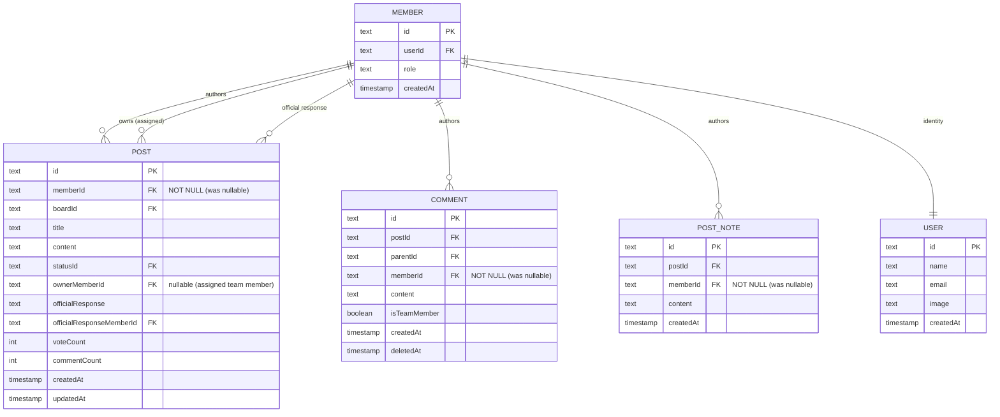

# Remove Redundant Author Fields, Require memberId Everywhere

## Overview

Posts, comments, and postNotes all carry redundant `authorName`, `authorEmail`, and `authorId` columns alongside a `memberId` FK. All interactive creation paths already require authentication and always set `memberId`, making these columns purely redundant except for one code path: **in-app CSV import**, which creates posts without a member record.

This refactor eliminates the redundancy by:

1. Making CSV import create user+member records (matching by email or creating new ones)
2. Backfilling existing memberless rows in a data migration
3. Making `memberId` NOT NULL on posts, comments, and postNotes
4. Dropping `authorName`, `authorEmail`, `authorId`, `officialResponseAuthorName`, and `officialResponseAuthorId` columns
5. Updating all queries to resolve author names via the member->user relation

## Problem Statement

The current dual-identity model creates confusion and maintenance burden:

- Every post write path stores the same name/email in two places (member->user AND direct columns)
- Types and interfaces carry 3 extra fields (`authorId`, `authorName`, `authorEmail`) on every entity
- Display code reads from the denormalized column but avatars from the member->user relation (inconsistent)
- CSV import is the only path that creates memberless posts, making the nullable `memberId` a special case for one feature
- If a user updates their name, the denormalized columns show stale data while the relation shows current data

## Proposed Solution

### Design Decisions

**D1. No-email CSV rows:** Attribute to the importing admin's member record. The admin is performing the import and takes ownership of unattributed content. This matches Canny's approach.

**D2. Member deletion:** Change FK from `onDelete: 'set null'` to `onDelete: 'restrict'` on posts and comments. Admins must handle a user's content before deleting them (future UX for reassignment/anonymization, out of scope here).

**D3. `memberId` NOT NULL:** Enforce at the schema level after data migration backfill. No nullable safety valve — the constraint is the point.

**D4. API response fields:** Keep `authorName` and `authorEmail` in API responses, populated from the member->user JOIN. No breaking API changes.

**D5. Event payloads:** Keep `authorEmail` in webhook/event payloads. Add `authorName` to event types so Slack/email notifications use real names instead of email-prefix parsing.

**D6. `ownerId` legacy column:** Remove alongside `authorId` — it's a legacy text field shadowed by `ownerMemberId`.

**D7. Name-change behavior:** Acceptable that author names show the user's current name, not the name at time of posting. This is standard relational behavior.

## Technical Approach

### ERD: Before vs After



**Columns removed from posts:** `authorId`, `authorName`, `authorEmail`, `ownerId`, `officialResponseAuthorId`, `officialResponseAuthorName`

**Columns removed from comments:** `authorId`, `authorName`, `authorEmail`

**Columns removed from postNotes:** `authorName`, `authorEmail`

### Implementation Phases

---

#### Phase 1: UserResolver Service

Create a reusable user resolution service for CSV import, adapted from the existing external import script's `UserResolver` (`scripts/import/core/user-resolver.ts`).

**New file:** `apps/web/src/lib/server/domains/import/user-resolver.ts`

```typescript
// Pseudocode
class UserResolver {
  private cache: Map<string, MemberId>

  async resolve(
    email: string | null,
    name: string | null,
    fallbackMemberId: MemberId
  ): Promise<MemberId> {
    if (!email) return fallbackMemberId
    if (this.cache.has(email)) return this.cache.get(email)!

    // 1. Look up existing member by email (user.email -> member.userId)
    // 2. If found, cache and return memberId
    // 3. If not found, create user + member (role='user'), cache and return
  }

  async resolveAll(rows: ImportRow[], fallbackMemberId: MemberId): Promise<Map<number, MemberId>> {
    // Batch: collect unique emails, resolve all at once, return index->memberId map
  }
}
```

**Files to modify:**

- `apps/web/src/lib/server/domains/import/import-service.ts` — integrate UserResolver into `processBatch()`
- `apps/web/src/lib/shared/schemas/import.ts` — no schema changes needed (author_name/email remain as CSV input fields, just used differently)

**Key behavior:**

- Email match is case-insensitive (`LOWER(email)`)
- Batch lookup: collect unique emails per batch, single `WHERE email IN (...)` query
- New users get `emailVerified: false`, `name` from CSV `author_name` or email prefix
- New members get `role: 'user'`
- Rows with no email: attributed to the importing admin's memberId

---

#### Phase 2: Data Migration (Backfill)

Create a Drizzle migration that backfills `memberId` for all existing rows where it's NULL.

**Migration script logic:**

```sql
-- Step 1: For posts/comments/postNotes where memberId IS NULL and authorEmail IS NOT NULL,
-- find or create user+member records and set memberId.
-- This is done as an application-level migration script (not pure SQL)
-- because it needs to create TypeIDs for new user/member records.

-- Step 2: For any remaining rows where memberId IS NULL and authorEmail IS NULL,
-- set memberId to a designated "system" member or the first admin member.
```

**New file:** `packages/db/src/migrations/backfill-member-ids.ts` (application-level migration script run via `bun run`)

This is a separate runnable script (not a Drizzle SQL migration) because:

- It needs to generate TypeIDs for new user/member records
- It needs conditional logic (find or create)
- It should be idempotent (safe to re-run)

**Files to modify:**

- `package.json` — add `db:backfill` script

---

#### Phase 3: Schema Changes

After backfill is confirmed complete, apply the schema changes.

**File:** `packages/db/src/schema/posts.ts`

Posts table changes:

- Remove: `authorId`, `authorName`, `authorEmail`, `ownerId`, `officialResponseAuthorId`, `officialResponseAuthorName`
- Change `memberId`: remove nullable wrapper, make NOT NULL
- Change `memberId` FK: `onDelete: 'restrict'` (was `'set null'`)
- Change `officialResponseMemberId` FK: keep `onDelete: 'set null'` (clearing response on member deletion is acceptable)

Comments table changes:

- Remove: `authorId`, `authorName`, `authorEmail`
- Change `memberId`: NOT NULL
- Change `memberId` FK: `onDelete: 'restrict'`

PostNotes table changes:

- Remove: `authorName`, `authorEmail`
- Change `memberId`: NOT NULL
- Change `memberId` FK: `onDelete: 'restrict'`

**Files to modify:**

- `packages/db/src/schema/posts.ts` — schema definitions
- `packages/db/src/schema/posts.ts` — relations (remove authorName from any relation mappings)
- Run `bun run db:generate` to produce the SQL migration

**Generated migration will contain:**

```sql
ALTER TABLE posts ALTER COLUMN member_id SET NOT NULL;
ALTER TABLE posts DROP COLUMN author_id;
ALTER TABLE posts DROP COLUMN author_name;
ALTER TABLE posts DROP COLUMN author_email;
ALTER TABLE posts DROP COLUMN owner_id;
ALTER TABLE posts DROP COLUMN official_response_author_id;
ALTER TABLE posts DROP COLUMN official_response_author_name;
-- (similar for comments and post_notes)
-- ALTER FK constraints for onDelete behavior
```

---

#### Phase 4: Update Service Layer (Write Paths)

**File:** `apps/web/src/lib/server/domains/posts/post.service.ts`

- `createPost()` (line ~96): Remove `authorName`, `authorEmail` from INSERT values. Keep `memberId`.
- `updatePost()` (line ~190): Remove `officialResponseAuthorName` write. Keep `officialResponseMemberId`.

**File:** `apps/web/src/lib/server/domains/comments/comment.service.ts`

- `createComment()` (line ~161): Remove `authorName`, `authorEmail` from INSERT values. Keep `memberId`.

**File:** `apps/web/src/lib/server/domains/posts/post.types.ts`

- Remove `authorName`, `authorEmail`, `authorId` from `CreatePostInput`, `Author` type, and related interfaces
- Remove `officialResponseAuthorName` from update types
- Keep `ownerId` references that actually map to `ownerMemberId`

**File:** `apps/web/src/lib/server/domains/comments/comment.types.ts`

- Remove `authorName`, `authorEmail` from `CreateCommentInput`, `CreateCommentResult`
- Remove `authorId` from `CommentThread`, `CommentContext`

**File:** `apps/web/src/lib/server/functions/posts.ts`

- Update `createPostFn` to stop passing `author.name`/`author.email` (only `memberId` needed)

**File:** `apps/web/src/lib/server/functions/public-posts.ts`

- Same as above for `createPublicPostFn`

**File:** `apps/web/src/routes/api/v1/posts/index.ts`

- Update POST handler to stop passing name/email to `createPost()`

---

#### Phase 5: Update Query Layer (Read Paths)

This is the largest phase. Every query that previously read `authorName`/`authorEmail` directly must now JOIN through member->user.

**File:** `apps/web/src/lib/server/domains/posts/post.public.ts`

- `listPublicPostsWithVotesAndAvatars()` (line ~158): Add user name subquery (pattern exists for avatar at line ~180)
  ```sql
  (SELECT u.name FROM member m JOIN "user" u ON m.user_id = u.id WHERE m.id = p.member_id) as author_name
  ```
- `getPublicPostDetail()` (line ~277): Same subquery pattern for post author. Rewrite raw SQL comment query (line ~353) to JOIN member->user for comment author names.
- Official response author: subquery from `officialResponseMemberId` -> member -> user

**File:** `apps/web/src/lib/server/domains/posts/post.query.ts`

- `listInboxPosts()` (line ~261): Add `with: { member: { with: { user: true } } }` to Drizzle query, map `member.user.name` to response
- `listPostsForExport()` (line ~363): JOIN member->user for name/email in export
- Pinned comment queries (line ~75): JOIN for comment author name

**File:** `apps/web/src/lib/server/domains/comments/comment.service.ts`

- `getCommentsByPost()`: Ensure member->user is included in query for author name resolution

**File:** `apps/web/src/lib/shared/comment-tree.ts`

- Update `CommentWithReactions` interface: replace `authorId`/`authorName`/`authorEmail` with resolved name from member->user
- Update `CommentTreeNode` similarly
- `buildCommentTree()` maps the resolved name

**File:** `apps/web/src/lib/server/domains/users/user.service.ts`

- `getPortalUserDetail()`: Update post author name references

**File:** `apps/web/src/routes/api/v1/posts/$postId.ts`

- GET handler: resolve `authorName`/`authorEmail` from member->user JOIN

**File:** `apps/web/src/routes/api/v1/posts/index.ts`

- GET list handler: resolve `authorName` from member->user

**File:** `apps/web/src/routes/api/v1/comments/$commentId.ts`

- GET handler: resolve `authorName`/`authorEmail` from member->user

**File:** `apps/web/src/routes/api/v1/posts/$postId.comments.ts`

- GET handler: resolve `authorName` from member->user

**File:** `apps/web/src/routes/api/export.ts`

- CSV export: get name/email from the JOIN result

**File:** `apps/web/src/routes/api/v1/users/$memberId.ts`

- Update post author name references

---

#### Phase 6: Update Event System

**File:** `apps/web/src/lib/server/events/types.ts`

- Add `authorName: string` to `EventPostData` and `EventCommentData`
- Keep `authorEmail` (still available from auth context at dispatch time)

**File:** `apps/web/src/lib/server/events/dispatch.ts`

- Pass `authorName` alongside `authorEmail` from auth context (already available in the `author` param)

**File:** `apps/web/src/lib/server/events/targets.ts`

- Line ~303: Use `event.data.comment.authorName` instead of `email.split('@')[0]`

**File:** `apps/web/src/lib/server/events/integrations/slack/message.ts`

- Use `authorName` for display, fall back to `authorEmail` if somehow missing

---

#### Phase 7: Update UI Components & Client Code

The UI components receive `authorName` as a prop — the prop name stays the same, but the data source changes. Most changes are in the server-side data preparation, not the components themselves. However, types need updating.

**Type updates:**

- `apps/web/src/lib/shared/types/inbox.ts` — `PostDetails`: authorName now comes from relation
- `apps/web/src/lib/client/queries/portal-detail.ts` — query return types

**Client mutation optimistic updates:**

- `apps/web/src/lib/client/mutations/portal-posts.ts` (line ~223): Use auth context name for optimistic `authorName`
- `apps/web/src/lib/client/mutations/portal-comments.ts` (lines ~28, 163): Same
- `apps/web/src/lib/client/mutations/comments.ts` (lines ~32, 235): Same

These already use the logged-in user's name for optimistic updates, so changes are minimal — just ensure the types align.

---

#### Phase 8: Update Seed & Tests

**File:** `packages/db/src/seed.ts`

- Remove `authorName`/`authorEmail` from post and comment INSERT values
- Posts/comments already have `memberId` set in seed data

**File:** `packages/db/src/__tests__/schema.test.ts`

- Update posts column count (29 -> 23: remove authorId, authorName, authorEmail, ownerId, officialResponseAuthorId, officialResponseAuthorName = -6)
- Update comments column count: remove authorId, authorName, authorEmail = -3
- Remove `authorId`, `authorName`, `authorEmail` from required columns assertions
- Update postNotes if tested

**File:** `apps/web/src/lib/server/domains/api/schemas/posts.ts`

- `authorName` and `authorEmail` fields stay in API response schemas (populated from JOIN)
- No changes needed to OpenAPI schemas

**File:** `apps/web/src/lib/server/domains/api/schemas/comments.ts`

- Same — `authorName`/`authorEmail` stay in response schemas

---

## Acceptance Criteria

### Functional Requirements

- [ ] CSV import creates user+member records for rows with `author_email`
- [ ] CSV import attributes no-email rows to the importing admin
- [ ] CSV import reuses existing user+member for known emails (case-insensitive)
- [ ] CSV import handles duplicate emails across rows efficiently (single lookup per unique email)
- [ ] All posts, comments, and postNotes have `memberId` NOT NULL after migration
- [ ] Post creation (admin, portal, API) continues to work with only `memberId`
- [ ] Comment creation continues to work with only `memberId`
- [ ] Author names display correctly in portal post lists (from member->user)
- [ ] Author names display correctly in admin inbox
- [ ] Author names display correctly in post detail views
- [ ] Author avatars continue to work (already use member->user)
- [ ] Official response shows correct author name (from `officialResponseMemberId`)
- [ ] CSV export includes author name and email (from member->user JOIN)
- [ ] Slack notifications show author name (not email prefix)
- [ ] Webhook payloads include `authorName` and `authorEmail` (from member->user)
- [ ] Email notifications use real author name
- [ ] API responses preserve `authorName`/`authorEmail` fields (no breaking API changes)
- [ ] Member deletion is blocked if member has posts/comments (`onDelete: 'restrict'`)

### Non-Functional Requirements

- [ ] CSV import of 10,000 rows completes without timeout (email resolution is batched/cached)
- [ ] Portal post list queries have no N+1 (author name resolved in same query)
- [ ] All existing tests pass after updates
- [ ] TypeScript compiles cleanly (`bun run typecheck`)

### Quality Gates

- [ ] `bun run test` passes
- [ ] `bun run lint` passes
- [ ] `bun run typecheck` passes
- [ ] Data migration script is idempotent (safe to re-run)
- [ ] Backfill migration tested on seed data before schema migration

## Dependencies & Risks

**Dependencies:**

- None external. All changes are internal to the codebase.

**Risks:**

1. **Raw SQL in `post.public.ts`**: The comment query at line ~353 uses raw SQL that explicitly references `c.author_name`. Must be carefully rewritten to JOIN through member->user. This is the highest-risk change.
2. **Neon HTTP driver limitation**: `import-service.ts` notes the driver doesn't support interactive transactions. User creation + member creation in the UserResolver cannot be wrapped in a single transaction. Orphaned user records (user without member) are possible but harmless.
3. **`onDelete: 'restrict'` blocking**: After this change, admins cannot delete users who have posts/comments. A future UX for content reassignment or anonymization will be needed. For now, this is the safe default.

## References

### Internal References

- Posts schema: `packages/db/src/schema/posts.ts:43-90`
- Comments schema: `packages/db/src/schema/posts.ts:201-229`
- PostNotes schema: `packages/db/src/schema/posts.ts:294-316`
- CSV import service: `apps/web/src/lib/server/domains/import/import-service.ts`
- External import UserResolver: `scripts/import/core/user-resolver.ts`
- Post creation service: `apps/web/src/lib/server/domains/posts/post.service.ts:94-130`
- Comment creation service: `apps/web/src/lib/server/domains/comments/comment.service.ts:155-175`
- Public post queries: `apps/web/src/lib/server/domains/posts/post.public.ts`
- Admin inbox queries: `apps/web/src/lib/server/domains/posts/post.query.ts`
- Comment tree builder: `apps/web/src/lib/shared/comment-tree.ts`
- Event types: `apps/web/src/lib/server/events/types.ts`
- Slack messages: `apps/web/src/lib/server/events/integrations/slack/message.ts`

### Competitor Research

- **Canny**: CSV import attributes all posts to importing admin. API allows specific author assignment.
- **UserVoice**: CSV import auto-creates/matches users by `created_by_user.email`; falls back to admin if blank.
