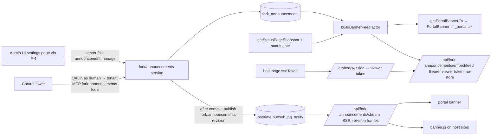

# Announcements Banner (Portal + Embeddable) — Design Plan v2

> **Status:** v2 (round 2) — supersedes `plans/v1/announcements-banner-widget-plan.md`. Planning only; nothing implemented.
> **Depends on:** Foundations (fork migration lineage, `fork_settings`, shared seams F-1..F-7, fork re-point
> registry — `02-fork-conventions.md` §3, §8, §10); `10-rbac-persona-extensions.md` Phase 1a (custom roles +
> permission keys enforced on MCP; "Fleet Agent" bundle) for Phase 4; `20-control-tower.md` (tower app +
> per-admin OAuth → tenant MCP) for Phase 4.
> **Decisions applied:** D1, D2, D-C1/D-C2 (tower acts through tenant MCP as the human; dual audit), D-N1
> (no localised content; English-only labels), D-N2 (browser-only dismissal), D-N3 (status fold-in), D-N4
> (plain text + per-type style presets + saved text templates), D-N5 (all portals private; no anonymous
> audience; embed identifies the viewer), D-N6 (instant push via `lib/server/realtime/*`), D-N7 🟡 (embed shows
> the identified user the same items as the portal, incl. segments), D-N8 (Fleet owners **and** Fleet Agents
> publish).
> **Goal:** Time-sensitive, typed alerts ("we're aware of an issue", maintenance notices) shown in the private
> portal and as an embeddable banner on customers' sites for identified users, authored per workspace in admin
> and centrally from the control tower, pushed to open viewers instantly.

## Round-2 changes

| Change | Driver |
| --- | --- |
| `severity` column → `kind` (`info`, `warning`, `critical`, `maintenance`, `success`) with **fixed presets** (colour tokens, icon, layout, dismiss/aria defaults) in code; authors only pick a kind and type text (+ optional link). No custom colours. | D-N4 |
| Saved **text templates** (`fork_settings` key `announcement_templates`) with `{placeholder}` substitution done **in the editor at authoring time**; stored announcements are plain text only. | D-N4 |
| Embed/portal chrome strings are English literals in `components/fork/**`; **locale seam dropped** (9 files), open item N-1 removed, no `init({ labels })`. | D-N1 |
| **Anonymous audience removed.** `audience.tier ∈ authenticated \| segments`; feed fails closed for non-`user` actors. The anonymous, edge-cached `active.json` is **removed**. Embed exchanges the host's signed widget identity JWT (`ssoToken`) for a short-lived viewer token and reads an authenticated, `no-store` feed. N-3 and N-6 closed. | D-N5 |
| Embed viewer resolves to the same principal, segment memberships and portal-access decision as the portal; banner refetches when the widget emits `identify`. | D-N7 🟡 |
| **Instant push:** writes publish a content-free `revision` event on logical channel `fork:announcements` via upstream `pubsub.publish`; portal and embed hold an SSE stream (new fork route reusing `subscribe`, `createSseStream`, `startStreamHeartbeat`, `createStreamLimiter`, HMAC stream-token pattern) and refetch on change. 30 s TTL / SWR design removed (N-5 closed). Scheduled go-live/expiry handled by a client timer at `nextTransitionAt` (still no jobs). | D-N6 |
| New seam: module-state ledger entry for a **dedicated** banner stream limiter (embeds on busy customer sites must not exhaust the chat stream budget). | D-N6 + module-state rule |
| `announcement.manage` granted to Manager (system) and the **"Fleet Agent"** custom-role template; Admin (fleet owner) holds it by construction. N-8 closed. | D-N8 |
| MCP registration, settings nav, Labs entry, catalogue edit now satisfied by shared seams F-3/F-4/F-6/F-7 — not counted. Tenant audit seam kept (N-9 → decided) and moved to Phase 1 so admin writes are audited from day one. | `02-…` §10, D-C2 |
| `created_by/updated_by_principal_id` declared as **exemptions** (staff-only) in the fork re-point registry (via F-5). | `02-…` §8 |

## 1. Changes from v1

| v1 issue (review §3.2 + coordinator findings) | v2 resolution |
| --- | --- |
| Over-built lifecycle: `scheduled`/`expired` states, publish/expire jobs, sweep, deadline provider | **Visibility derived from time at read**: `status = 'published' AND publish_at <= now AND (expires_at IS NULL OR expires_at > now)` — changelog precedent (`changelog.public.ts:39`, `changelog.query.ts:56`). States `draft \| published \| archived` only. No jobs, no sweep, no `hook-job.ts` case, no `startup.ts` arming. Viewers learn about time transitions from `nextTransitionAt` (§4.3). |
| v1 planned a new `earliestWorkspaceDeadline` provider | Not needed: nothing is scheduled server-side. |
| `notified_at` claim column | Dropped from Phases 1–4; optional Phase 5 registers a claim in `packages/db/src/side-effect-ledger.ts`. |
| Cached public `active.json` with `widgetCorsHeaders()` / `publicWorkspaceCacheHeaders` | **Removed (D-N5/D-N6).** All data endpoints are authenticated and `no-store`; freshness comes from push, not TTL. Only `banner.js` (code, no data) stays edge-cacheable. |
| "Sanitize rich body with `sanitize-tiptap`" | **Plain text + optional link** (D-N4). Clients insert text nodes only. |
| No private-portal / audience enforcement | Portal: `resolvePortalAccessForRequest()` (`functions/portal-access.ts:63`). Embed: same decision via exported `evaluatePortalAccess` (`domains/settings/portal-access.ts:149`) for the JWT-verified viewer (§4.7). Audience via `tierAllows` (`policy/access.ts:19`). |
| Prelude reused `window.__QUACKBACK_URL__` / `__QUACKBACK_CONFIG__` | Banner prelude sets `window.__QUACKBACK_BANNER__ = { url, config }`; IIFE global `QuackbackBanner`. |
| Widget bundle budget ignored | Portal banner component is lean; `bun run check:widget-bundle` is a Phase 2 gate. |
| No locale strings | Superseded by D-N1: English-only chrome, no locale files touched. |
| No permission key | `announcement.manage` (category `status_page`) — §6. |
| `announcement_dismissals` table | Dropped (D-N2): `localStorage` keyed by id + `updatedAt`. |
| `settings.announcements_config` column | `fork_settings` keys `announcements`, `announcement_templates`. |
| TypeID PK, schema in upstream dir | `fork_announcements`, `uuid` PK, `packages/db/src/fork/schema/announcements.ts`, fork lineage. |
| Tower writes via `withWorkspaceScopeById` | Moot (D-C1/D-C2): tower calls fork MCP tools with the admin's OAuth token. |
| "Reuses `publish-widget.yml`" | New IIFE entry in `packages/widget/tsup.config.ts`, built by `apps/web/Dockerfile:41`; served by the app, no npm publish. |
| CSP unstated | §4.7. |
| Status fold-in coupled to raw tables | Only via `getStatusPageSnapshot()` (`domains/status/status.public.ts:123`) + exported gate helpers. |
| Widget identity reuse for embeds | **Designed (D-N5/D-N7), §4.7** — was open item N-6. |

## 2. Requirements

| #   | Requirement |
| --- | --- |
| R1  | Publish time-sensitive alerts of a fixed **kind** (info, warning, critical, maintenance, success) with optional link, schedule and expiry; styling comes from the kind's preset only. |
| R2  | Render in the **portal** (above `<main>`) and as an **embeddable banner** on external sites, for identified viewers only. |
| R3  | App-specific: rows live in the workspace's own DB; every read resolves the workspace per `Host`. |
| R4  | Central management from the control tower (single app or broadcast), attributable to the human (D-C2); Fleet owners and Fleet Agents may publish (D-N8). |
| R5  | Time-based visibility without jobs; client-side dismissal; audience = all portal-authorised users or segments; private portal respected on both surfaces. |
| R6  | Live status incidents / maintenance appear in the same strip (D-N3). |
| R7  | Publish/update/archive reach open portals and embeds instantly (D-N6). |
| R8  | Saved text templates for common notices; placeholders filled at authoring time. |
| R9  | Fork-safe: fork dirs, fork lineage, minimal seams; pass module-state / authz / host-vary / bundle guardrails. |

## 3. Architecture overview



One feed builder (`buildBannerFeed(actor, surface)`) serves both surfaces so they never diverge. The stream
carries **no content** — only "revision changed" — so audience filtering stays in the feed read.

## 4. Design

### 4.1 Fork code layout

| Kind | Path |
| --- | --- |
| Schema | `packages/db/src/fork/schema/announcements.ts` (barrel `packages/db/src/fork/index.ts`) |
| Migration | `packages/db/drizzle-fork/NNNN_fork_announcements.sql` |
| Domain | `apps/web/src/lib/server/fork/announcements/{announcements.service.ts, feed.ts, status-feed.ts, config.ts, templates.ts, revision.ts, embed-viewer.ts, viewer-token.ts, stream-limit.ts}` |
| Server fns | `apps/web/src/lib/server/fork/announcements/functions.ts` |
| MCP tools | `apps/web/src/lib/server/mcp/tools/fork-announcements.ts`, listed in `mcp/tools/fork-index.ts` (F-3) |
| Shared | `apps/web/src/lib/shared/fork/announcements/{types.ts, schema.ts (zod), visibility.ts, presets.ts, placeholders.ts}` |
| Components | `apps/web/src/components/fork/announcements/{portal-banner.tsx, banner-bar.tsx, editor-form.tsx, template-picker.tsx, preview.tsx, use-banner-stream.ts}` |
| Settings registration | `components/fork/settings/fork-settings-modules.ts` (F-4); Labs `fork-announcements` in `lib/shared/fork/labs.ts` (F-6) |
| Routes | `routes/admin/settings.fork-announcements.tsx` (+ `.templates.tsx`, `.install.tsx`); `routes/api/fork-announcements/{stream.ts, banner[.]js.ts, embed/session.ts, embed/feed.ts}` |
| Embed SDK | `packages/widget/src/fork/banner/{banner-queue.ts, render.ts, dismiss.ts, styles.ts, stream.ts, presets.ts}` |

Module state: all fork server code is request-scoped except **one** deliberate instance — the dedicated
stream limiter in `stream-limit.ts` (§4.6, seam 4). No feed caches, no revision memo, no compressed-bundle
`Map` (`banner[.]js.ts` compresses per request, unlike `sdk[.]js.ts:17`). `packages/widget` is outside the
module-state roots.

### 4.2 Content model, presets and templates (D-N4)

- Fields: `kind` (required), `title` (≤ 140, required), `body` (plain text ≤ 500, optional),
  `link_url` (http/https via `sanitizeUrl`, `lib/shared/utils/sanitize`) + `link_label`. Clients render with
  `textContent` / React text nodes only — no HTML anywhere.
- **Presets** (`lib/shared/fork/announcements/presets.ts`, mirrored byte-for-byte in
  `packages/widget/src/fork/banner/presets.ts`; a unit test asserts equality): one entry per kind —

  | Kind | Colour token | Icon (inline SVG) | Defaults |
  | --- | --- | --- | --- |
  | `info` | `--fork-info` (blue) | info-circle | dismissible, `aria-live=polite` |
  | `warning` | `--fork-warning` (amber) | exclamation-triangle | dismissible, polite |
  | `critical` (incident) | `--destructive` (red) | x-octagon | dismissible, `role=alert` |
  | `maintenance` | `--fork-maintenance` (violet) | wrench | time window from `publishAt`/`expiresAt` appended to the text; dismissible, polite |
  | `success` (resolved) | `--success` (green) | check-circle | dismissible, polite; `expires_at` defaulted to +24 h in the editor |

  **One component, one layout for every kind** (mockup: https://claude.ai/artifact/XAn1u4GewieesuMGHsua43, board
  "Announcements — standard banner types"): icon · bold type title · text · optional link · dismiss. **Every banner of every
  kind is dismissible by the user** (D-N9); there is no author-side "not dismissible" option. Same height, padding, type sizes, link and dismiss styling across
  kinds; the kind changes only the colour token and icon. Background = 10 % tint of the kind colour over
  `--background` (16 % in dark mode), border = 35 % (40 % dark), title/link = kind colour mixed toward
  `--foreground` for contrast. Placement variants only: full-width strip in the portal/hub; rounded floating bar
  (with `--radius` and shadow) in the embed.
  Authors cannot change colours, icons, layout or dismissibility.
- **Branding (D-X1, conventions §11).** Kind colours are **semantic and consistent across apps** (info is always
  blue, incident always red) so users read them the same way everywhere; they are fork tokens with light and dark
  values, overridable per app via `customCss`. Everything else — background, foreground, font, radius, dark mode —
  comes from the app's theme, and tints/borders are derived with `color-mix()` against the app's `--background`, so
  each app's branding restyles its banners automatically. The portal banner inherits
  the portal's injected theme. The **embed** receives the app's generated theme variables
  (`generateWorkspaceThemeCSS` output, plus font family) in its session/feed payload and applies them to `:host` in its
  shadow root, so a banner on a customer's own site matches that app's branding too.
  Sort rank: critical > maintenance (active) > warning > info > success.
- **Saved templates** (`fork_settings` key `announcement_templates`, zod-validated, ≤ 50 entries):
  `{ id: uuid, name, kind, title, body?, linkUrl?, linkLabel? }`. When the key is absent, three code-defined
  starters are offered ("Scheduled maintenance {date} {time}", "Investigating: {service}", "Resolved: {service}");
  saving an edit writes the key. Managed on `settings.fork-announcements.templates.tsx` under
  `announcement.manage`.
- **Minimal templating** (`lib/shared/fork/announcements/placeholders.ts`, pure): placeholders are
  `{identifier}` (`/\{([a-zA-Z][a-zA-Z0-9_]{0,31})\}/g`) in `title`, `body`, `linkUrl`, `linkLabel`.
  Choosing a template in the editor lists its placeholders as inputs (names `date`/`time`/`start`/`end` get
  date/time pickers, formatted in the author's locale as plain text), substitutes on submit, and the stored
  announcement is **plain text with no template reference**. The editor blocks publish while `{…}` tokens that
  match a template placeholder remain; the server does **not** interpret braces (literal `{…}` text is legal),
  and renderers never substitute anything. Tower compose uses the same pure helper (templates read via the
  `list_announcement_templates` MCP tool).

### 4.3 Visibility (time-derived)

`lib/shared/fork/announcements/visibility.ts`:

```ts
isLive(a, now) = a.status === 'published' && a.publishAt <= now && (a.expiresAt === null || a.expiresAt > now)
```

- SQL form in the feed query; index `(status, publish_at, expires_at)`.
- "Publish now" = `status='published', publish_at=now()`; "Schedule" = future `publish_at`; "Expire now" =
  `expires_at=now()`; "Archive" = `status='archived'`. Admin list shows a derived label
  (Draft / Scheduled / Live / Expired / Archived) — never stored.
- **Time transitions without jobs:** the feed also returns `nextTransitionAt` = the earliest future
  `publish_at` (published rows on this surface whose audience the actor passes) or `expires_at` among returned
  items. Clients set one timer to refetch at that instant (+0–5 s jitter) and re-apply the `expiresAt` check on
  every render, so a scheduled item appears on time and an expired one disappears on time with no server event.

### 4.4 Feed builder and audience

`feed.ts` — `buildBannerFeed(actor: Actor, surface: 'portal' | 'embed', access: PortalAccessDecision)`:

1. If `!access.granted` → `[]` (D-N5: every portal is private; the caller supplies the decision, §4.6/§4.7).
2. If `actor.principalType !== 'user'` and `!isTeamActor(actor)` → `[]` (fails closed even if a workspace's
   portal is misconfigured as public — there is no anonymous audience).
3. Load live rows where `surfaces ? surface`, filter `tierAllows(actor, audience.tier, audience.segmentIds)`
   (`policy/access.ts:19`). `audience.tier ∈ 'authenticated' | 'segments'` (UI: "Everyone with portal
   access" / "Specific segments"); `isTeamActor` short-circuits to all (team preview).
4. If `announcements.foldInStatus`, append `status-feed.ts` items.
5. Sort (kind rank, `priority desc`, `publishAt desc`), cap 5; UI shows first + "N more".

`BannerItem`: `{ id, source: 'announcement' | 'status', kind, title, body, link: {url,label} | null,
priority, publishAt, expiresAt, updatedAt }`. Feed response:
`{ enabled, revision, nextTransitionAt, items }`.

### 4.5 Status fold-in (D-N3)

Unchanged from round 1 except mapping target and freshness:

- Gate from exported parts of the private `resolveStatusPageGate()` (`functions/status.ts:757-777`):
  `getStatusSettings()` (`domains/settings/settings.status.ts:41`), `isFeatureEnabled('statusPage')`
  (`settings.service.ts:1003`), `isStatusPagePublished()` (`lib/shared/status-settings.ts:53`),
  `isStatusAudienceGranted(actor, settings)` (`domains/status/status.audience.ts:15`).
- Data: `getStatusPageSnapshot(actor, settings)` (`status.public.ts:123`) → `activeIncidents`,
  `upcomingMaintenance` (segment narrowing already applied for `actor`).
- Mapping: `impact critical|major → critical`, `minor → warning`, `none → info`, `kind maintenance →
  maintenance`, incident in `resolved` within the last hour → `success`; upcoming maintenance only within
  `statusLeadHours` (default 24). Link → `/status/<incidentId>` (absolute for the embed). Status items'
  dismissal key includes their `updatedAt`.
- **Freshness:** status writes do not publish our revision event (that would need a handler in upstream
  `events/targets.ts` for `status.incident_*` / `status.maintenance_*` — a seam we avoid). Status items refresh
  on any revision event, window focus, `nextTransitionAt` (scheduled maintenance start), and a 5-minute
  safety refetch while visible. See open item N-10.
- Contract test `fork/announcements/__tests__/status-feed.contract.test.ts` pins the 6 symbols +
  `PublicStatusIncident` fields (`status.types.ts:316`). Do not import `components/portal/status/*`. The portal
  banner hides `source='status'` items on `/status*`.

### 4.6 Instant push (D-N6)

**Why a new fork stream route rather than reusing `/api/chat/stream`:** that route is gated on
`isConversationsEnabled()` (`routes/api/chat/stream.ts:134-142`), marks presence for every stream (`:289`),
and only accepts `scope`/`conversationId`/`ticketId`; adding an announcements branch would be a seam in a
high-churn upstream file and would count banner viewers as chat presence. No other portal- or widget-wide
stream exists (the only `subscribe` caller under `routes/` is `chat/stream.ts:300`). The fork route reuses
upstream's primitives unchanged.

- **Publish** (`revision.ts`): after every committed write (upsert, archive, draft delete, config or template
  change) the service calls `publish(ANNOUNCEMENTS_CHANNEL, { rev })` (`realtime/pubsub.ts:306`,
  fire-and-forget) with `ANNOUNCEMENTS_CHANNEL = 'fork:announcements'`. `rev` = sha256 over
  `max(updated_at), count(*)` of `fork_announcements` + the `announcements` config's updated time, computed in
  the same request (no stored counter, no module memo). The payload is tiny and content-free, well under the
  7,800-byte inline limit (`pubsub.ts:62`). Called inside the request's workspace scope (admin server fn or MCP
  request), which `publishAsync` requires (`currentWorkspaceNamespace()`, `pubsub.ts:312`).
- **Stream** `routes/api/fork-announcements/stream.ts` (GET, SSE), mirroring `chat/stream.ts`:
  1. Authenticate: `?token=` → `verifyBannerStreamToken` (embed, §4.7); otherwise the session cookie via
     `auth.api.getSession` + `resolvePortalAccessForRequest()` (portal, same-origin `EventSource` sends
     cookies). Unauthenticated or access denied → 401/404. Labs/`enabled` off → 404.
  2. Reserve a slot on the **dedicated** `announcementStreamLimiter` (`createStreamLimiter` from
     `realtime/stream-connection-limit.ts:77`; e.g. `maxGlobal 300, maxPerWorkspace 200, maxPerIp 20`). Refused →
     503; the client falls back to a 60 s poll of the feed.
  3. `createSseStream` (`lib/server/utils/sse.ts:35`), `retry: 5000`, then an **initial `revision` frame**
     computed from the DB so a reconnecting client catches any event missed while disconnected (pub/sub is
     fire-and-forget).
  4. `subscribe(['fork:announcements'], …)` (`pubsub.ts:256`) forwards each payload as `event: revision`.
  5. `startStreamHeartbeat` (`realtime/stream-heartbeat.ts:40`) reaps abandoned tabs; teardown releases the
     slot and unsubscribes, re-entering the captured workspace scope exactly as `chat/stream.ts:252-281`.
  6. Headers: `SSE_RESPONSE_HEADERS`; token requests add `Access-Control-Allow-Origin: *` (no credentials, so a
     plain cross-origin `EventSource` works without preflight).
- **Client** (`use-banner-stream.ts` for the portal; `packages/widget/src/fork/banner/stream.ts` for the
  embed): opens the stream only while `document.visibilityState === 'visible'`, closes it when hidden and
  refetches on return; on a `revision` different from the last feed's, refetches after 0–2 s random jitter
  (broadcast fan-out would otherwise stampede the tenant DB); re-mints the embed stream token on reconnect.
- **Pooled tenancy:**
  - Isolation is upstream's: the logical channel rides inside the per-workspace envelope; the registry is keyed
    by `(namespace, channel)` and `dispatch` refuses envelopes naming another workspace (`pubsub.ts:121-150`).
    No workspace id in the channel name is needed.
  - One refcounted session-mode LISTEN connection per workspace per replica (`pubsub.ts:194-245`), shared with
    chat. It **pins the tenant's compute while any viewer is connected** (`chat/stream.ts:411-414`); closing
    streams on hidden tabs and heartbeat reaping bound this, but a workspace with an embed on a busy site will
    effectively stay warm. Accepted consequence of D-N6.
  - Stream-token signing uses `activeSecretKey()` (`lib/server/secret-key.ts:37`), per workspace under pooling,
    so a token minted under workspace A fails verification under B.
  - Why a dedicated limiter: the shared `streamLimiter` (`stream-connection-limit.ts:151`) allows 100 streams
    per workspace; embed viewers on a customer's site would exhaust it and refuse agents' inbox and visitors'
    chat streams. The dedicated instance is module-level state by necessity (a process-local concurrency
    gauge, same category `workspace-keyed` as `ledger.ts:196-205`) → ledger seam 4 + `MODULE-STATE.md`
    regeneration. Global FD headroom: 500 (chat) + 300 (banner) per process — to be confirmed in load test (N-11).

### 4.7 Embeddable banner (Phase 3) — identified viewers only (D-N5, D-N7)

**Identity.** The host page passes the **same** signed identity JWT it gives the widget (HS256 over
`settings.widget_secret`, `lib/server/widget/identity-token.ts:27,54`): `QuackbackBanner('identify', { ssoToken })`
or `init({ ssoToken })`. Reusing the widget's session is **not feasible**: the host SDK forwards `identify` to
the iframe over postMessage (`packages/widget/src/core/sdk.ts:83,211`) and only receives the resulting user
object (`:119-131`); the session token lives inside the iframe origin. The banner does subscribe to
`window.Quackback('on', 'identify', …)` (`sdk.ts:379-380`) when the widget is present and refetches after it
fires, so a first-visit user created by widget identify sees segment-targeted items immediately (D-N7).

- **`POST /api/fork-announcements/embed/session`** `{ ssoToken }` (JSON → CORS preflight; `OPTIONS` via the
  existing `preflightResponse()`/`corsHeaders()` in `lib/server/integrations/apps/cors.ts:15-21`, precedent
  `routes/api/track.ts:17`):
  1. `enforcePerIpLimit` (`widget/public-endpoint.ts:45`, `keyPrefix 'fork-ann-session'`, 30/min); embed or
     Labs off → `{ enabled:false }`.
  2. `getWidgetSecret()` (`settings.widget.ts:426`) + `verifyHS256JWT` (`identity-token.ts:54`); require
     `sub|id` and `email` — the same claims `/api/widget/identify` requires (`routes/api/widget/identify.ts:195-213`).
  3. `embed-viewer.ts` resolves the principal **read-only** (user by `externalId = sub`, then
     `lower(email)`; principal by `userId`) — no user creation, no segment reconcile, no session, no
     changelog auto-subscribe (those stay with widget identify). Blocked principal (`isBlocked`,
     `domains/principals/blocking.ts:39`) → empty.
  4. Returns `{ viewerToken, expiresAt }`: fork HMAC token (`viewer-token.ts`, pattern of
     `realtime/stream-token.ts`, domain tag `fork-announcements-viewer:v1`, `activeSecretKey()`, TTL 12 h)
     over `{ principalId | null, email, externalId }`. Held in memory only (not `localStorage`); a page load
     re-exchanges a fresh `ssoToken`.
- **`GET /api/fork-announcements/embed/feed`** with `Authorization: Bearer <viewerToken>` (preflighted):
  re-validates on every call (principal still exists / not blocked, embed enabled), builds the actor —
  `principalType 'user'`, `role 'user'` (non-dashboard audiences are portal-tier, as `chat/stream.ts:125`),
  `segmentIds = segmentIdsForPrincipal(principalId)` (`segment-membership.service.ts:232`, empty when no
  principal) — and the **portal-access decision** via `evaluatePortalAccess`
  (`domains/settings/portal-access.ts:149`) with `isAuthenticated: true`, `emailVerified: true` (signed by the
  customer's backend), `hasViaWidgetMarker: true`, `identifyVerificationEnabled: true`, plus the same invite and
  allowed-segment lookups `resolvePortalAccessForRequest` performs (`functions/portal-access.ts:120-196`).
  Then `buildBannerFeed(actor, 'embed', decision)`. Response adds a 2-minute `streamToken`
  (`fork-announcements-stream:v1`). Headers `corsHeaders()` (`no-store, private`). An unknown-principal viewer
  who passes portal access sees `authenticated`-tier items only (no memberships yet).
- The replicated access composition is pinned by `embed-viewer.contract.test.ts` over `PortalAccessContext`
  fields; open item N-12 offers upstream a principal-based `resolvePortalAccessForIdentity` export.
- **Bundle:** tsup IIFE entry `banner: 'packages/widget/src/fork/banner/banner-queue.ts'`,
  `globalName: 'QuackbackBanner'`, `dist/banner.js`, ≤ 10 KB gz (presets + SSE client), no deps; size test in
  `packages/widget/src/fork/banner/__tests__/size.test.ts`. Built by `Dockerfile:41`.
- **Serve** `routes/api/fork-announcements/banner[.]js.ts`: inlines `dist/banner.js?raw` with prelude
  `window.__QUACKBACK_BANNER__={url,config:{placement}}`; headers `Content-Type`, `Access-Control-Allow-Origin: *`,
  `...publicWorkspaceCacheHeaders(300, 'Accept-Encoding')` (code only, no data — the one cacheable route).
  Disabled → no-op script (mirrors `sdk[.]js.ts:74-79`). Without `identify`, the banner renders nothing and
  makes no data request.
- **Client:** shadow root on a host `<div>` at `body` start (or `container`); presets per kind; `textContent`
  only; links `rel="noopener noreferrer"`, http(s) only; dismissal in host `localStorage` (`qb.banner.*`,
  try/catch); English chrome ("Dismiss", "View details", "N more"); stream per §4.6.
- **Coexistence with the widget:** separate global, prelude key and storage keys; optional read-only use of
  `window.Quackback('on','identify')`.
- **CSP (install page):** `script-src <instance>`; `connect-src <instance>` (fetch + `EventSource`); styles via
  constructable stylesheets (`adoptedStyleSheets`), fallback `<style>` in the shadow root needs
  `'unsafe-inline'` or `init({ nonce })` (the widget already injects a `<style>`, `packages/widget/src/core/style.ts:8-13`);
  no `frame-src`, no `img-src` (inline SVG icons).
- **Install page** `settings.fork-announcements.install.tsx`: snippet showing `ssoToken` reuse from the widget
  identify call, CSP block, note that the embed shows nothing to unidentified visitors.

### 4.8 Portal banner (Phase 2)

- `getPortalBannerFn` (`createServerFn GET`): `getOptionalAuth()` + `policyActorFromAuth()`
  (`functions/auth-helpers.ts:240,341`) + `resolvePortalAccessForRequest()` → `buildBannerFeed(actor,'portal', decision)`.
  No `requireAuth` (non-user actors get `[]` inside), so it appears in `MATRIX.md` §4 "entry points without a
  gate"; no `classifications.ts` entry.
- `portal-banner.tsx` is self-fetching (`useQuery`, `staleTime: Infinity`, invalidated by the stream's
  `revision`, window focus, `nextTransitionAt` timer); the `_portal.tsx` seam is one JSX line + import between
  `<PortalHeader …/>` and `<main>` (`routes/_portal.tsx:381-390`).
- Renders only when Labs `fork-announcements` and `announcements.enabled`. Dismissal
  `localStorage['qb.banner.dismissed']` (id → `updatedAt`). Presets drive `role`/`aria-live`.
- English literals (D-N1); `components/fork/**` is outside `PORTAL_SOURCE_ROOTS`
  (`lib/shared/__tests__/portal-message-coverage.test.ts:19-25`), so no locale keys are needed.
- Imports allowed: React, `lib/shared/fork/announcements/*`, heroicons. Forbidden: Tiptap/editor,
  `components/portal/status/*`.

### 4.9 Admin authoring (Phase 1)

- Page registered through F-4 (`fork-settings-modules.ts` adds "Announcements" to the workspace module);
  guarded by `announcement.manage`; shows an "enable in Labs" notice when the experiment is off.
- List (derived-state chips), editor: **kind picker with live preset preview** (same `banner-bar.tsx`),
  "Start from template" (placeholder inputs, §4.2), title, body, link, priority, surfaces, audience (all /
  segments, reusing the existing segment list fn), publish-now / schedule / expire (no dismissibility control — every banner is dismissible, D-N9).
- Templates page; config panel (`enabled`, `embedEnabled`, `foldInStatus`, `statusLeadHours`, `placement: 'top'`).
- Server fns, each `requireAuth({ permission: PERMISSIONS.ANNOUNCEMENT_MANAGE })`: `listAnnouncementsFn`,
  `getAnnouncementFn`, `upsertAnnouncementFn`, `archiveAnnouncementFn`, `deleteDraftAnnouncementFn`,
  `getAnnouncementsConfigFn`, `updateAnnouncementsConfigFn`, `listAnnouncementTemplatesFn`,
  `saveAnnouncementTemplatesFn`. Service functions take `principalId` so admin and MCP share them; each write
  records the audit event and publishes the revision after commit.

### 4.10 Control-tower management (Phase 4, R4)

- `mcp/tools/fork-announcements.ts`, listed in `mcp/tools/fork-index.ts` (F-3), via `registerTool`
  (`mcp/tools/helpers.ts:177`): `list_announcements`, `upsert_announcement`, `archive_announcement`,
  `list_announcement_templates`. Each: `scope: 'write:feedback'` (read tools `read:feedback`) —
  `scopeForPermission('announcement.manage')`, `lib/shared/api-key-scopes.ts:247-253`, `status_page` → feedback
  at :226 — `teamOnly: true`, and an **in-handler** `announcement.manage` check via the MCP permission helper
  from `10-…` Phase 1a.
- Who can publish (D-N8): fleet `owner` → tenant Admin (holds every key); fleet `agent` → "Fleet Agent" custom
  role, whose template bundle includes `announcement.manage` (owned by `10-…` §4.2); Manager also holds it.
  Fleet Observer does not.
- The tower calls with the admin's OAuth token (D-C2), so `created_by/updated_by_principal_id` name the human.
  `origin: { source: 'tower', broadcastId, towerActor }`; `towerActor` informational only; server forces
  `source='tower'` only for OAuth callers.
- **Broadcast:** fan-out of `upsert_announcement` with a shared `broadcastId`; partial unique index makes
  retries idempotent. Each tenant write publishes its own revision event → instant on every tenant.
- **Audit (D-C2 dual audit, N-9 decided):** `fork_announcement.created|updated|archived` added to
  `AuditEventType` (`audit/log.ts:44`, closed union → seam 3), recorded via `recordAuditEvent` (`:223`) for admin
  and MCP writes; tower writes `tower_audit`.

## 5. Data model

`fork_announcements` (`packages/db/src/fork/schema/announcements.ts`, migration `NNNN_fork_announcements.sql`):

| Column | Type | Notes |
| --- | --- | --- |
| `id` | `uuid` PK `defaultRandom()` | |
| `kind` | `text not null` CHECK in (`info`,`warning`,`critical`,`maintenance`,`success`) | selects the preset; text+CHECK, not a PG enum |
| `title` | `text not null` | CHECK `char_length <= 140` |
| `body` | `text null` | plain text, CHECK `<= 500` |
| `link_url`, `link_label` | `text null` | http(s) validated in zod |
| `status` | `text not null default 'draft'` CHECK in (`draft`,`published`,`archived`) | |
| `publish_at` | `timestamptz not null default now()` | |
| `expires_at` | `timestamptz null` | CHECK `expires_at IS NULL OR expires_at > publish_at` |
| `priority` | `integer not null default 0` | |
| `surfaces` | `jsonb not null default '["portal"]'` | subset of `portal`,`embed` (`widget` reserved, N-7) |
| `audience` | `jsonb not null default '{"tier":"authenticated","segmentIds":[]}'` | `tier` ∈ authenticated/segments |
| `origin` | `jsonb not null default '{"source":"local"}'` | `{source:'local'\|'tower', broadcastId?, towerActor?}` |
| `created_by_principal_id`, `updated_by_principal_id` | `typeIdColumnNullable('principal')` FK `on delete set null` | staff-only → **exemption** in `fork/principals/fork-repoint.ts` (F-5) |
| `created_at`, `updated_at` | `timestamptz not null default now()` | `updated_at` feeds the revision |

Indexes: `fork_announcements_live_idx (status, publish_at, expires_at)`; `fork_announcements_broadcast_uq`
unique on `((origin->>'broadcastId'))` where `origin ? 'broadcastId'`. No `notified_at`, no dismissals table,
no templates table.

`fork_settings` keys (zod, defaults on read):
- `announcements`: `{ enabled: false, embedEnabled: false, foldInStatus: true, statusLeadHours: 24, placement: 'top' }`.
- `announcement_templates`: `Array<{ id, name, kind, title, body?, linkUrl?, linkLabel? }>` (≤ 50); absent → code starters.

## 6. Permissions

| Key | Category | Owner/Admin | Manager | Fleet Agent (custom template) | Contributor | Enforced at |
| --- | --- | --- | --- | --- | --- | --- |
| `announcement.manage` | `status_page` | yes | **yes** (not in `WORKSPACE_ADMIN_PERMISSIONS`) | **yes** (D-N8) | no | every admin server fn (`requireAuth({ permission })`); MCP tools (scope + in-handler check) |

- Added in the F-7 fenced blocks of `PERMISSIONS` / `PERMISSION_CATALOGUE` (`packages/db/src/rbac-catalogue.ts`;
  `status_page` category :167). Manager = all minus `WORKSPACE_ADMIN_PERMISSIONS` (:613-642, filter :649) →
  granted. Contributor is an explicit list (:653+) → not granted.
- "Fleet Agent" template bundle (owned by `10-…` §4.2, currently Contributor preset + ticket keys) must add
  `announcement.manage`.
- Config and template writes use the same key; Labs toggling stays with upstream's Labs permission.
- The embed session/feed/stream endpoints are viewer reads (no permission key); gated by JWT verification +
  portal access.
- After editing: `bun run db:permissions`; regenerate `MATRIX.md`.

## 7. Seams

Shared seams used, not counted: F-1 (fork migrations), F-2 (drift), F-3 (MCP tools), F-4 (settings page),
F-5 (re-point exemption), F-6 (Labs `fork-announcements`), F-7 (`announcement.manage`).

| # | Upstream file | Change (one-liner) | Why unavoidable | How to re-apply |
| --- | --- | --- | --- | --- |
| 1 | `apps/web/src/routes/_portal.tsx` | import + `<ForkAnnouncementsBanner />` between `PortalHeader` and `<main>` | No slot in the portal layout | Re-insert directly after the `PortalHeader` element |
| 2 | `packages/widget/tsup.config.ts` | `banner` IIFE entry | Only build that runs before the app build (`Dockerfile:41`) | Re-add the extra config object |
| 3 | `apps/web/src/lib/server/audit/log.ts` | 3 members `fork_announcement.*` in `AuditEventType` (Phase 1) | Closed union; D-C2 requires app-native audit | Re-append members at union end (same union as 40's A-1) |
| 4 | `apps/web/src/lib/server/policy/module-state/ledger.ts` | Entry for `announcementStreamLimiter` in `lib/server/fork/announcements/stream-limit.ts`, category `workspace-keyed` (Phase 2) | Process-local concurrency gauge is module state by nature; sharing upstream's limiter would starve chat streams | Re-append entry; regenerate `MODULE-STATE.md` |

**Count: 4 seams (4 files).** Dropped vs round 1: rbac catalogue (F-7), Labs registry (F-6), settings nav (F-4),
MCP index (F-3), 9 locale files (D-N1). Generated (regenerate): `lib/shared/permissions.ts`, `MATRIX.md`,
`MODULE-STATE.md`, `GRAPH.md`. Not touched: `settings` schema, `classifications.ts`, `hook-job.ts`,
`startup.ts`, `jobs/deadlines.ts`, `routes/api/chat/stream.ts`, `realtime/*`, `events/targets.ts`,
`packages/widget/src/core/*`, `packages/widget/package.json`, locale files.

## 8. Phases and validation gates

| Phase | Deliverable | Gate |
| --- | --- | --- |
| **1. Data + authoring** | Table + migration, service, `visibility.ts`, `presets.ts`, `placeholders.ts`, templates key + page, config, key via F-7, Labs via F-6, page via F-4, re-point exemption via F-5, audit members (seam 3), revision publish | Fork drift clean; `isLive` + placeholder unit tests; Manager and a Fleet-Agent-template role can author, Contributor 403; audit rows name the author; `MATRIX.md` regenerated; module-state green |
| **2. Portal banner + push + status** | `feed.ts`, `status-feed.ts`, `getPortalBannerFn`, `portal-banner.tsx`, `_portal.tsx` mount, `stream.ts` route, dedicated limiter (seam 4) | `check:widget-bundle` passes; unauthenticated / access-denied → nothing; segment row only to members; publish in admin appears in an open portal tab < 2 s without reload; archive disappears likewise; scheduled item appears at `publish_at` via timer; hidden tab closes the stream; limiter refusal falls back to polling; open incident appears / resolves |
| **3. Embed** | tsup entry, `banner[.]js.ts`, `embed/session.ts`, `embed/feed.ts`, viewer/stream tokens, shadow-DOM renderer + SSE client, install page | host-vary green; no request without `identify`; bad/expired `ssoToken` → 403; identified user sees the same items as in the portal incl. segments (D-N7); widget `identify` on first visit triggers refetch; token from workspace A rejected on B; preflight OK; strict-CSP page renders; widget + banner coexist; publish reaches the embed instantly |
| **4. Tower** | MCP tools (F-3), tower UI (`20-…`) | Needs `10-…` Phase 1a + `20-…` OAuth. Publish to A only; broadcast A+B arrives instantly on both; retry idempotent; fleet owner and Fleet Agent succeed, Fleet Observer denied; tenant audit names the human |
| **5. Notifications (optional)** | `announcement.published` event → in-app/email for `critical` | `notified_at` claim registered in `side-effect-ledger.ts` (seam); events catalogue + template seams |

## 9. Testing strategy

- **Unit:** `isLive` boundaries; `nextTransitionAt`; sorting/capping by kind rank; audience × actor via
  `tierAllows` (non-user → empty, authenticated, segment member/non-member, team); status mapping incl.
  `success`; presets parity (app vs widget copy); placeholder extraction/substitution (unknown tokens left
  untouched, max 32-char names); zod rejects `javascript:` links and over-length text; viewer/stream token
  sign/verify/expiry/domain separation.
- **DB (fork lineage):** journal integrity; broadcast unique index; CHECKs (`kind`, lengths, expiry).
- **Contract:** `status-feed.contract.test.ts`; `embed-viewer.contract.test.ts` (`PortalAccessContext` fields,
  `evaluatePortalAccess` signature, `verifyHS256JWT`, `getWidgetSecret`, `segmentIdsForPrincipal`);
  realtime primitives (`subscribe`, `publish`, `createStreamLimiter`, `startStreamHeartbeat`, `createSseStream`).
- **Route:** stream — 401 without auth, 404 on private-portal denial, initial `revision` frame, forwards a
  published revision, releases slot on abort, 503 at limiter cap; embed session/feed — preflight headers,
  `no-store`, rate limit, blocked principal empty, unknown principal gets authenticated-tier only;
  `banner.js` prelude uses `__QUACKBACK_BANNER__` only.
- **Realtime DB test (pooled):** two workspaces on the fleet harness; a revision published in A is never
  delivered to B's stream (extends the `pubsub.db.test.ts` pattern).
- **Guardrails in CI:** host-vary, module-state (with the new ledger entry), authz-matrix, `check:widget-bundle`.
- **Embed (Playwright):** host page with widget + banner sharing one `ssoToken`; strict CSP; live update on
  publish; tab hide/show reconnect.
- **Isolation probe (pooled):** row in A never served under B's Host (portal, embed, MCP list).
- **MCP:** scope/teamOnly/permission denial; Fleet Agent template allowed, Fleet Observer denied; idempotent
  `broadcastId` upsert.

## 10. Open items

| ID | Question | Proposed default |
| --- | --- | --- |
| D-N7 | (01-decisions "Still open") Confirm embeds on widget sites show the identified user the same announcements as the portal, incl. segment-targeted ones. | 🟡 yes — designed in §4.7 |
| N-4 | Ask upstream for a slim exported `getActiveStatusNotices(actor)` (snapshot also computes history per refetch). | 🟡 offer upstream; tolerate cost meanwhile |
| N-7 | Also show a strip inside the widget panel (`surfaces: widget`)? Touches widget routes. | ⏳ reserved value, not built |
| N-10 | Status incidents are not pushed instantly (would need a handler seam in `events/targets.ts`); they refresh on focus, any revision, and a 5-minute visible-tab safety refetch. Acceptable? | 🟡 yes; revisit if incident latency matters |
| N-11 | Dedicated banner stream limiter sizes (300 global / 200 per workspace / 20 per IP) and FD headroom next to chat's 500; and acceptance that an embed on a busy site keeps the tenant's compute warm via the LISTEN connection. | 🟡 adopt; confirm in pooled load test |
| N-12 | Offer upstream an exported `resolvePortalAccessForIdentity({ principalId, email, emailVerified, viaWidget })` so `embed-viewer.ts` stops replicating the invite/segment composition of `resolvePortalAccessForRequest`. | 🟡 offer upstream; contract test meanwhile |

Closed this round: N-1 (D-N1), N-2 (D-N4), N-3 (D-N5), N-5 (D-N6), N-6 (D-N5/D-N7), N-8 (D-N8), N-9 (seam kept, D-C2).

## 11. Relationship to other v2 plans

- **Foundations / `02-fork-conventions.md`:** fork lineage, `fork_settings`, shared seams F-1..F-7, re-point
  registry. Note: `02-…` §6 still says fork portal/widget UI strings are "added to all locales (seam)" — with
  D-N1 this plan adds none; the fork components are outside the coverage roots.
- **`10-rbac-persona-extensions.md`:** owns the F-7 block entry for `announcement.manage` and the "Fleet Agent"
  template — which must now include `announcement.manage` (D-N8; its §4.2 bundle and §6 table need a column/row
  update). Phase 4 needs its MCP permission enforcement.
- **`20-control-tower.md`:** owns tower compose/target picker/broadcast/`tower_audit`. It currently states
  announcements are fleet-`owner` only ("agent cannot") and names tools `create_/update_announcement`; both must
  align with D-N8 and this plan's `upsert_announcement` / `archive_announcement` / `list_announcement_templates`.
- **`40-support-account-actions.md`:** shares the `AuditEventType` union seam (A-1); co-locate fork members.
- **`30-` / `50-`:** independent. Phases 1–3 ship without the tower; Phase 4 lands with/after `20-…`.
